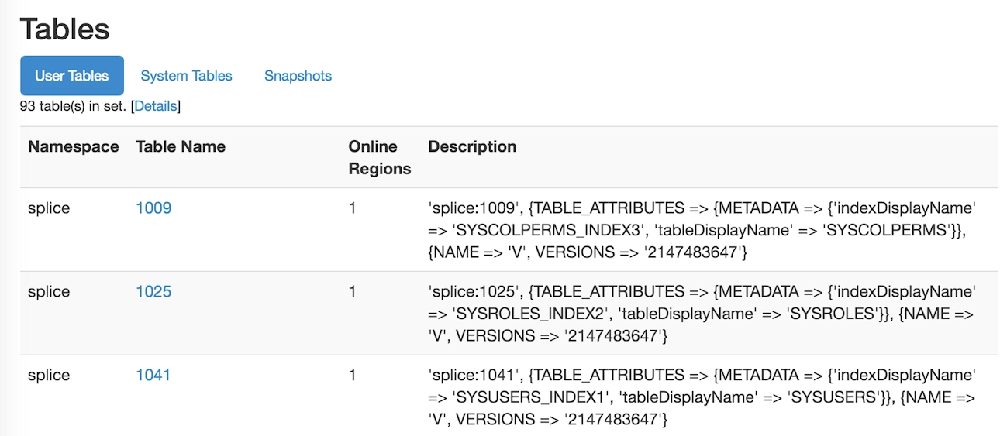

[Open topic with navigation](../../index.html#OnPremise/Developers/WorkingWithHBase.html)

Working with HBase
==================

This topic presents information about working in HBase with Splice Machine, in these sections:

-   The [Mapping Splice Machine Tables to HBase](#MappingTables) section shows you how to view your Splice Machine tables and how map the table names that we see in HBase to the more descriptive table names that we see in Splice Machine.
-   The [Accessing HBase Master](#AccessingHbaseMaster) section shows you how to access HBase Master so that you can peek under the surface a bit.

[]()[]()Mapping Splice Machine Tables to HBase
----------------------------------------------

If you are looking at tables in the Splice Machine database that do not appear to match what you see in the HBase Master Web user interface, they may not match up. To view your Splice Machine tables in HBase, follow these steps:

1.  Use the Splice interactive command interface to view the tables:

    You can use the <span class="CodeFont">show tables</span> command to view the tables in your Splice Machine database:

    ``` Example
    TABLE_SCHEM     |TABLE_NAME         |CONGLOM_ID|REMARKS
    -------------------------------------------------------------
    SYS             |SYSALIASES         |368       |             
    SYS             |SYSBACKUP          |944       |             
    SYS             |SYSBACKUPFILESET   |976       |             
    SYS             |SYSBACKUPITEMS     |1056      |             
    SYS             |SYSBACKUPJOBS      |1184      |             
    SYS             |SYSCHECKS          |384       |             
    SYS             |SYSCOLPERMS        |640       |             
    SYS             |SYSCOLUMNS         |80        |             
    SYS             |SYSCOLUMNSTATS     |1216      |             
    SYS             |SYSCONGLOMERATES   |48        |             
    SYS             |SYSCONSTRAINTS     |336       |             
    SYS             |SYSDEPENDS         |272       |             
    SYS             |SYSFILES           |288       |             
    SYS             |SYSFOREIGNKEYS     |240       |             
    SYS             |SYSKEYS            |320       |             
    SYS             |SYSPERMS           |816       |             
    SYS             |SYSPHYSICALSTATS   |1264      |             
    SYS             |SYSPRIMARYKEYS     |1424      |             
    SYS             |SYSROLES           |752       |             
    SYS             |SYSROUTINEPERMS    |672       |             
    SYS             |SYSSCHEMAS         |32        |             
    SYS             |SYSSEQUENCES       |800       |             
    SYS             |SYSSTATEMENTS      |256       |             
    SYS             |SYSTABLEPERMS      |656       |             
    SYS             |SYSTABLES          |64        |             
    SYS             |SYSTABLESTATS      |1280      |             
    SYS             |SYSTRIGGERS        |304       |             
    SYS             |SYSUSERS           |880       |             
    SYS             |SYSVIEWS           |352       |             
    SYSIBM          |SYSDUMMY1          |1296      |      
    ```

2.  View the tables in the HBase Master Web Console:

    To view the HBase tables, use the HBase Master Web Console, at <span class="CodeFont">http://localhost:60010/</span>.

    Note that all of the user tables in the <span class="ItalicFont">Tables</span> section have numeric names; the numbers match the conglomerate number (<span class="CodeFont">CONGLOM\_ID</span>) values displayed by the <span class="CodeFont">show tables</span> command.

    

    These numbers are used in HBase as directory names; you can find those directories in your file system and examine the tables directly.

[]()[]()Accessing HBase Master
------------------------------

If you are an HBase veteran or someone interested in seeing a little of what goes on under the surface, you can access HBase Master with the default HBase URL:

``` ShellCommand
http://localhost:60010
```

Because Splice Machine encodes and compresses the data for space efficiency, the actual data in your tables is virtually unreadable.

<span class="autonumber"><span class="noteAutoNum">NOTE:  </span></span>In this version, Splice Machine has purposely left ports 60010 and 60030 open for people to see the HBase tables. If security is an issue in your deployment, you can easily block this access.

 


