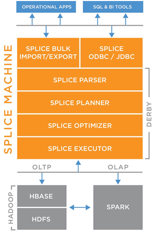
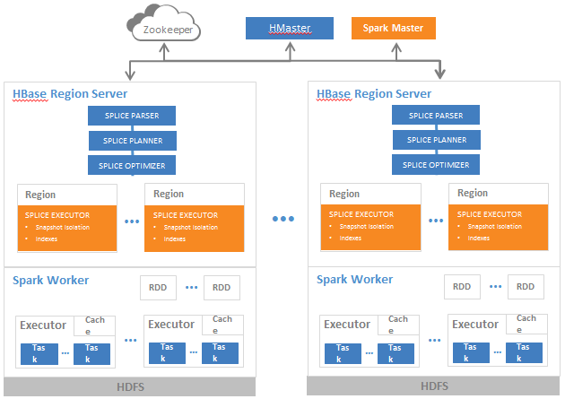
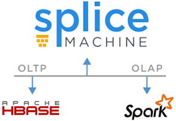

[Open topic with navigation](../../index.html#OnPremise/GettingStarted/ArchitectureOvervew.html)

Splice Machine Architectural Overview
=====================================

This topic presents an overview of the Splice Machine architecture, and includes a brief overview of the Hadoop ecosystem.

How Splice Machine Works
------------------------

Splice Machine provides a standard SQL database on a distributed computing infrastructure that can be scaled out horizontally. This makes it possible to build both operational (OLTP) and analytical (OLAP) applications that can easily scale to handle data growth. Our architecture features dual engines, one for running OLAP queries on Spark, and another for running OLTP queries on HBase/Hadoop; this means that OLAP and OLTP workloads are isolated and can run in parallel with minimal impact upon each other.

Splice Machine combines our own customized components with three proven technology building blocks:

| Technology          | Highlights                                             |
|---------------------|--------------------------------------------------------|
| Apache Derby        | -   ANSI SQL-99 RDBMS                                  
                       -   Java-based                                          
                       -   ODBC/JDBC compliant                                 |
| Apache HBase/Hadoop | Proven scale-out:                                      
                                                                               
                       -   Auto-sharding                                       
                       -   Scales with commodity hardware                      
                       -   Cost-effective from Gigabytes to Petabytes          
                       -   High availability through failover and replication  
                       -   LSM-trees                                           |
| Apache Spark        | -   Unmatched performance:                             
                                                                               
                           -   Fastest sort of 1 PB of data                    
                       -   Advanced in-memory technology:                      
                                                                               
                           -   Spill-to-disk for large datasets                
                           -   Resilient against node failures                 
                           -   Pipelining for computation parallelism          
                       -   Extensive Libraries:                                
                                                                               
                           -   Machine learning                                
                           -   Streaming                                       
                           -   Graph processing                                
                           -   Over 150 libraries and growing                  
                       -   Highly active developer community:                  
                                                                               
                           -   About 500 committers as of late 2015            |

Here's a diagram of the Splice Machine technology stack:

### Advanced Spark Integration

As you can see, Splice Machine integrates our Spark and HBase engines; we do this by using a universal execution plan and universal byte code, which allows us to share the optimizer, plan, and code for execution on both Spark and HBase.

Our advanced Spark integration also features an innovative mechanism for creating high-performance Spark RDDs that:

-   provide fast access to HFiles in HDFS
-   are merged with deltas from Memstore
-   avoid the slower HBase API

### Splice Machine Cluster Deployment

The following diagram shows how Splice Machine is typically deployed across a set of HBase Region Servers in a cluster, which requires these three steps:

1.  Perform a standard installation of an HBase cluster (HBase, HDFS, and ZooKeeper) with Spark.
2.  Distribute the Splice Machine JAR to each region server in your cluster.
3.  Automatically invoke coprocessors on each region.

The following diagram illustrates Splice Machine running on a cluster with multiple HBase region servers; each of the orange boxes in the diagram indicates an HBase coprocessor:

About the Hadoop Ecosystem
------------------------------

Hadoop is an open-source distributed platform for storing and processing large data sets. It helps control big data processing costs by distributing computing across commodity servers instead of using expensive, specialized servers. Commodity hardware refers to machines that are inexpensive, already available or easily obtainable, and interchangeable with similar hardware. Commodity computing is seen as a more scalable solution because purchasing additional high-cost, high-performance servers to keep up with the growth of big data quickly becomes prohibitively expensive.

[Hadoop](https://hadoop.apache.org/) was inspired by big data operations created at Google, and developed at Yahoo, which turned it over to the Apache Software Foundation. Apache continues to maintain it as an open-source project with a global community of users and contributors. The Apache Hadoop framework includes the following modules:

-   Hadoop Distributed File System (HDFS), a Java-based distributed file system designed to store data on commodity servers. HDFS stores files by dividing them into smaller blocks and replicating them on three or more servers. It is highly fault-tolerant and provides high throughput access to application data. HDFS is well suited for the storage of large files. HDFS is designed more for batch processing rather than interactive use by users. The emphasis is on high throughput of data access rather than low latency of data access.
-   MapReduce, a batch programming model that uses parallel processing — basically, using more than one CPU to execute a task simultaneously — to make processing big data faster, cheaper, and more manageable.
-   Hadoop YARN, a resource-management and scheduling platform. YARN removes the resource management and scheduling responsibilities from MapReduce, optimizing cluster utilization and allowing MapReduce to focus on data processing.
-   Hadoop Common, which consists of the libraries and utilities required by other Hadoop modules.

Beyond these core components, Hadoop includes an entire ecosystem of technologies based on HDFS, including:

-   [Apache HBase](https://hbase.apache.org/), a key-value data store inspired by Google’s Big Table.
-   [Apache Hive](https://hive.apache.org/), a SQL-based, analytic query engine.
-   [Apache Pig](https://pig.apache.org/), a procedural language.
-   [Apache Spark](http://spark.apache.org/), a fast, in-memory engine for large-scale data processing.
-   Commercial technologies such as [Splice Machine](http://www.splicemachine.com/), which is a Hadoop RDBMS with joins and transactions.

A typical Hadoop environment comprises a master node and several worker nodes. Most Hadoop deployments consist of several master node instances to mitigate the risk of a single point of failure. A Hadoop environment can include hundreds or even thousands of worker nodes. Hadoop’s ability to store, process, and analyze large data sets in a cost-effective manner has made it the defacto architecture for today’s big data environments.

Hadoop differs from a traditional relational database, in that strictly speaking, it is a storage and batch data processing system. Hadoop itself is built for data processing with the Map-Reduce paradigm, not for use with a structured query language like SQL. There are commercial distributions of Hadoop, including Cloudera, Hortonworks, and MapR, that add functionality and improve reliability. There are also Hadoop-based tools that blur the once sharp line between Hadoop and traditional relational databases, such as Splice Machine, which provides Hadoop with the capabilities of a RDBMS to run business-critical operational applications and adds Spark processing power for analytic queries.

### About HBase

Apache HBase is an open-source distributed database modeled after Google's BigTable and is one of the key building blocks of Splice Machine. It delivers scalability up to dozens of petabytes and supports automatic sharding, data replication, and real-time updates. HBase provides very fast reads and writes, but it does not provide a SQL interface or key RDBMS functionality, such as joins, secondary indexes, or ACID transactions.

[HBase](http://hbase.apache.org/) is a type of NoSQL database, which means that it is not a relational database; instead it is designed to be a scalable, distributed database (or data store, if you prefer) that supports structured data storage for large tables. HBase provides very fast reads and writes, but it does not provide a SQL interface or key RDBMS functionality such as joins, secondary indexes, or ACID transactions. HBase also provides strong consistency, automatic sharding, and automatic failover for RegionServers, which are based on commodity machines to allow for easy and inexpensive cluster expansion.

### About Derby

Apache Derby is a Java-based, full-featured ANSI SQL database. Splice Machine replaces Derby's storage layer with HBase, retains the Derby parser, and uses its own, redesigned planner, optimizer, and executor components to leverage the HBase computation engine. HBase co-processors are used to embed Splice Machine in each distributed HBase region, allowing us to achieve massive parallelization by pushing the computation down to each distributed data shard. This auto-sharding and failover technology enables real-time, incremental writes on top of the immutable Hadoop file system.

### Apache Spark

Apache Spark is an open source cluster computing framework for large-scale data processing. In contrast to Hadoop's two-stage disk-based MapReduce paradigm, Spark's multi-stage in-memory primitives provide very large performance boosts for certain applications: you can load data into a cluster's memory and then query it very efficiently and repeatedly. Splice Machine automates this for you.

[Spark](http://spark.apache.org/) requires a cluster manager and a distributed storage system. Spark can interface with a wide variety of systems, including the Hadoop Distributed File System (HDFS). Spark also supports a pseudo-distributed local mode, usually used only for development or testing purposes, where distributed storage is not required and the local file system can be used instead; in such a scenario, including the standalone version of Splice Machine, Spark is run on a single machine with one executor per CPU core.

How Query Execution Works in Splice Machine
-------------------------------------------

Splice Machine added Spark processing of certain queries in version 2.0. Every query is considered analytic or operational in nature:

-   Analytic queries require high throughput, so Splice Machine runs them using the Spark engine.
-   Operation queries require low latency, so Splice Machine runs them directly, using HBase queries.

The first four steps are the same for executing a query using HBase or Spark:

1.  Parse the SQL.
2.  Optimize the query.
3.  Generate optimal byte code for the query.
4.  Send the query to our OLTP execution engine on HBase, or send it to our Spark engine.

### OLTP Execution on HBase

Running a Splice Machine query on HBase uses these steps:

1.  Execute the OLTP query from byte code.
2.  Use block cache and bloom filters to optimize data access.
3.  Return the results.

### OLAP Execution on Spark

Running a Splice Machine query on Spark uses these steps:

1.  Generate the Spark execution plan.
2.  Submit the Spark plan with byte code.
3.  Use fair scheduling of distributed tasks.
4.  Generate a RDD from HFiles and Memstore.
5.  Execute the query and return results.

#### Spark Resource Management

Splice Machine allows you to configure Spark resource management by prioritizing query, admin, and import jobs. You can also define your own custom resource pools in XML and assign priorities to them. For example, you might assign these weights (higher numbers indicate higher priority) to different resource pools:

| Resource Pool | Scheduling Mode | Assigned Priority Weight |
|---------------|-----------------|--------------------------|
| import        | FAIR            | 10                       |
| query         | FAIR            | 20                       |
| admin         | FAIR            | 1                        |
| urgent        | FAIR            | 1000                     |

#### Managing Spark Queries with the Splice Machine Management Console

The Splice Machine Management Console includes an interface that you can use to watch Spark queries execute in real time. This interface includes visualization of each query stage, with detailed metrics for the tasks in each stage, which makes it very useful for determining where each query is spending its time. You'll find its documentation in our [Using the Splice Machine Management Console](../../Shared/ManagementConsole/Intro.ManagementConsole.html) book.

 

