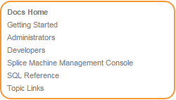
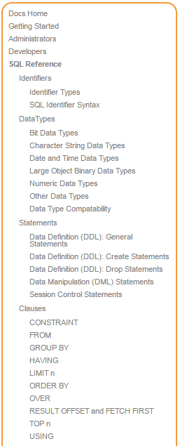
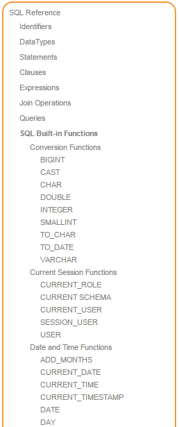
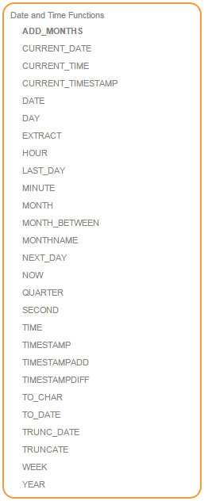
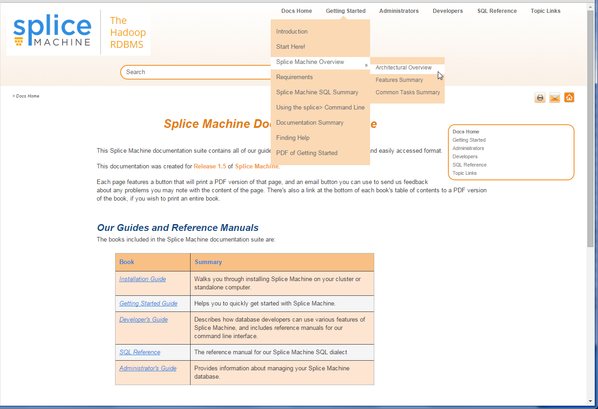
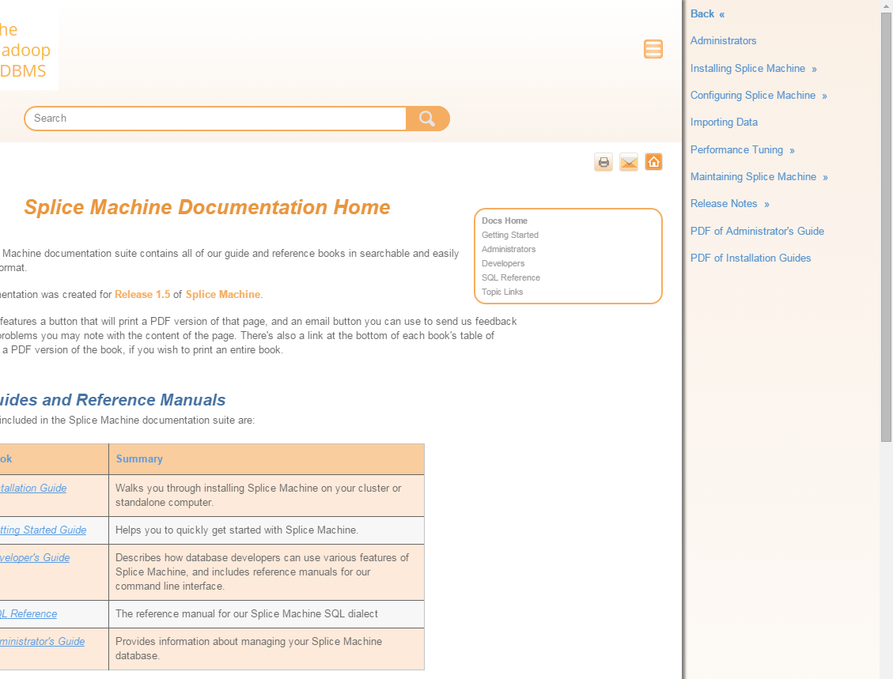
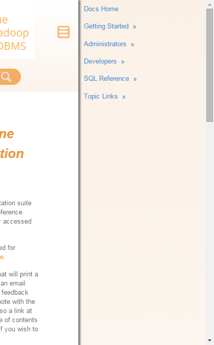
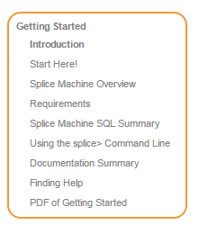
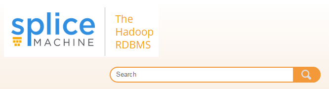
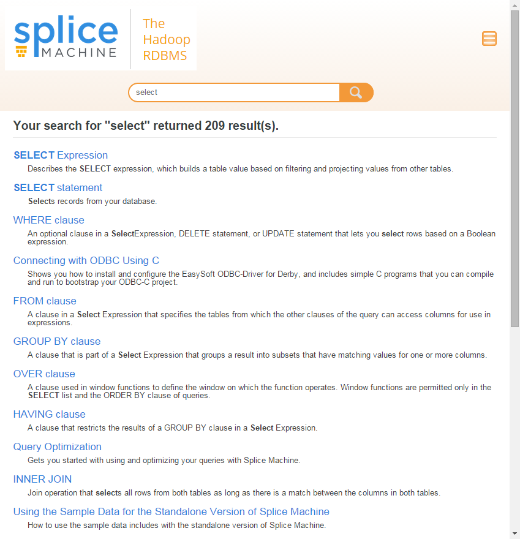

[Open topic with navigation](../../index.html#OnPremise/GettingStarted/DocsSummary.html)

Documentation Summary
=====================

The Splice Machine Documentation is separated into these books:

| Section                                                                                                                              | Description                                                                                                                                                                                                                                                    |
|--------------------------------------------------------------------------------------------------------------------------------------|----------------------------------------------------------------------------------------------------------------------------------------------------------------------------------------------------------------------------------------------------------------|
| [<span class="ItalicFont">Getting Started</span>](Intro.GettingStarted.html)                                                         | This Guide provides an overview of Splice Machine and helps you to quickly get going with using your database.                                                                                                                                                 |
| [<span class="ItalicFont">Installation Guide</span>](../InstallingSpliceMachine/Intro.InstallationGuide.html)                        | This Guide provides step-by-step instructions for installing Splice Machine on various platforms.                                                                                                                                                              |
| <span class="ItalicFont">[Command Line (splice&gt;) Reference](../../Shared/CmdLineReference/Intro.CmdLineReference.html)</span>     | The reference manual for our command line interface.                                                                                                                                                                                                           |
| [<span class="ItalicFont">SQL Reference</span>](../../Shared/SQLReference/Intro.SQLReference.html)                                   | The complete reference for Splice Machine SQL.                                                                                                                                                                                                                 |
| <span class="ItalicFont">Developers</span>                                                                                           | Contains a number of sections for database developers:                                                                                                                                                                                                         
                                                                                                                                                                                                                                                                                                                                                                                                        
                                                                                                                                        -   <span class="ItalicFont">[Developer Fundamentals](../../Shared/Developers/Fundamentals/Intro.Fundamentals.html)</span> contains topics describing the fundamentals of developing your database with Splice Machine.                                         
                                                                                                                                        -   <span class="ItalicFont">[Connecting Your Database](../../Shared/Developers/Connecting/Intro.Connecting.html)</span> shows you how to connect to specific Business Intelligence tools, and how to use JDBC and ODBC with Splice Machine.                    
                                                                                                                                        -   <span class="ItalicFont">[Functions and Stored Procedures](../../Shared/Developers/FcnsAndProcs/Intro.FcnsAndProcs.html)</span> contains a number of topics of interest to advanced database developers.                                                    
                                                                                                                                        -   <span class="ItalicFont">[Tuning and Debugging](../../Shared/Developers/TuningAndDebugging/Intro.TuningAndDebugging.html)</span> contains topics that help you to optimize and debug your queries.                                                          
                                                                                                                                        -   <span class="ItalicFont">Tutorials</span> contains an ever-expanding list of tutorials to help you zero in on the best ways to work with Splice Machine.                                                                                                    |
| <span class="ItalicFont">Administrators</span>                                                                                       | The Administrator's Guide contains a number of sections for database administrators:                                                                                                                                                                           
                                                                                                                                                                                                                                                                                                                                                                                                        
                                                                                                                                        -   <span class="ItalicFont">Configuring Splice Machine</span> tells you how to configure database attributes such as logging, authentication, and user authorization.                                                                                          
                                                                                                                                        -   <span class="ItalicFont">[Importing Data](../../Shared/Developers/ImportingData.html)</span> tells you how to import data into your Splice Machine database.                                                                                                
                                                                                                                                        -   <span class="ItalicFont">[Performance Tuning](../../Shared/Developers/TuningAndDebugging/Intro.TuningAndDebugging.html)</span> describes Splice Machine's statistical collection and analysis tools that you can use to tune performance of your database.  
                                                                                                                                        -   <span class="ItalicFont">Maintaining Splice Machine</span> describes how to performance periodic maintenance tasks on your Splice Machine database.                                                                                                         
                                                                                                                                        -   [<span class="ItalicFont">Release Notes</span>](../ReleaseNotes/Intro.ReleaseNotes.html) contains release and update notes for the current release, and for previous releases.                                                                              |
| [<span class="ItalicFont">The Splice Machine Management Console</span>](../../Shared/ManagementConsole/Intro.ManagementConsole.html) | Describes and shows you how to use the Splice Machine Management Console, which is a browser-based tool for monitoring and reviewing the performance of your queries.                                                                                          |
| [<span class="ItalicFont">Notes</span>](../../Shared/Notes/Intro.Notes.html)                                                         | Release notes, glossary, license information, and other noteworthy information.                                                                                                                                                                                |

Typographic Conventions Used in Our Books
-----------------------------------------

We use the following style conventions in the Splice Machine books:

| Style                                                        | Usage                                                                                                                        |
|--------------------------------------------------------------|------------------------------------------------------------------------------------------------------------------------------|
| <span class="CodeFont">Code font</span>                      | Fixed width font used for all code and any literal information that you might need to enter. For example:                    
                                                                                                                                                                                              
                                                                A table named <span class="CodeFont">Players</span> with primary key <span class="CodeFont">player\_id</span>                 |
| <span class="AppCommand">Application command</span>          | Anything that represents a specific application or is displayed by a specific application. For example:                      
                                                                                                                                                                                              
                                                                ``` AppCommand                                                                                                                
                                                                hbase -> Actions -> Stop                                                                                                      
                                                                hdfs1 -> Actions -> Stop                                                                                                      
                                                                zookeeper1 -> Actions -> Stop                                                                                                 
                                                                ```                                                                                                                           |
| <span class="Example">Example</span>                         | Code and command examples. For example:                                                                                      
                                                                                                                                                                                              
                                                                ``` Example                                                                                                                   
                                                                splice> CREATE TABLE NewPlayers                                                                                               
                                                                   AS SELECT *                                                                                                                
                                                                         FROM Players WITH NO DATA;                                                                                           
                                                                0 rows inserted/updated/deleted                                                                                               
                                                                ```                                                                                                                           |
| <span class="Highlighted">Highlighted text</span>            
 (<span class="HighlightedCode">Highlighted code font</span>)  | Text that is a placeholder, showing you that you need to substitute your own value for the highlighted portion. For example: 
                                                                                                                                                                                              
                                                                ``` AppCommand                                                                                                                
                                                                Maximum Client Connections = 0                                                                                                
                                                                Maximum Session Timeout    = 120000                                                                                           
                                                                ```                                                                                                                           |
| <span class="ShellCommand">Shell command</span>              | Text displayed by an operating system. For example:                                                                          
                                                                                                                                                                                              
                                                                ``` ShellCommand                                                                                                              
                                                                sudo -su hdfs hadoop fs -rm -r /hbase                                                                                         
                                                                ```                                                                                                                           |

[]()Tips for Navigating the Documentation
-----------------------------------------

The Splice Machine documentation uses a navigation model that allows you to see more content at one time while still providing a full menu of the topics in the entire documentation suite.

### Navigating Through the Books

If you're using a browser on a computer or tablet, you'll see a menu displayed on the right side that simplifies navigation for you. Here's the top-level menu, which allows you to navigate to the opening page of one of the books in our documentation suite:



<span class="autonumber"><span class="noteAutoNum">TIP:  </span></span>The topic (page) that you're currently viewing is always highlighted in <span class="BoldFont">bold</span> in the navigation menu.

You can always return to the docs home page by clicking the Home button in the toolbar near the top of each page:


If you click the <span class="AppCommand">SQL Reference</span> entry in the navigation menu, you'll land on the top view of our <span class="ItalicFont">SQL Reference Manual</span>, which looks like this:



<span class="autonumber"><span class="noteAutoNum">NOTE:  </span></span>If you now click on the <span class="AppCommand">SQL Reference</span> entry at the top of the menu, you'll land back on the documentation home menu.

The <span class="ItalicFont">SQL Reference Manual</span> is by far our largest book, and also includes the most complex hierarchical structure. If you next click the <span class="AppCommand">SQL Built-in Functions</span> entry in the navigation menu, you'll see that the built-in functions category expands to show its subcategories and topic pages, like this:



Now, if you click the <span class="AppCommand">SQL Built-in Functions</span> link, you'll land back on the top-level menu for the <span class="ItalicFont">SQL Reference Manual</span>.

<span class="autonumber"><span class="noteAutoNum">NOTE:  </span></span>You can always click on the topmost link or category link in the menu to jump back up to that level in the navigation structure.

As a final illustration of navigating through the menu hierarchy, you can click the <span class="AppCommand">ADD\_MONTHS</span> link to land on the topic page for that function, which looks like this:



In this version of the navigation menu, you can:

-   click <span class="AppCommand">Date and Time Functions</span> to move back up to the Built-in SQL Functions level of the SQL Reference
-   then click <span class="AppCommand">Built-in SQL Functions</span> to move up to the top level of the SQL Reference Manual
-   then click <span class="AppCommand">SQL Reference</span> to move back to the Docs home page

Different Views for Different Screen Sizes

Depending on the width of your screen or window (the <span class="ItalicFont">display</span>), the menu is displayed as a drop-down from the top of the display or as a pull-aside menu that automatically expands and collapses on the right side of the display. If you're using a computer with a screen wider than 1280 pixels, you can see this by reducing and enlarging the width of your browser window. We use three different views:

| View name | Window width range (in pixels) |
|-----------|--------------------------------|
| Desktop   | &gt;= 1280                     |
| Tablet    | 768 - 1279                     |
| Mobile    | &lt;= 767                      |

Accessing the Menu in Desktop View

To access the menu in desktop view, use the drop-down text-labeled menu at the top of the browser window. A local context-sensitive menu appears on every page to help you navigate relative to the page without using the menu:



Accessing the Menu in Tablet View

To access the menu in tablet view, use the pull-aside menu on the right, accessed by clicking the menu icon near the top-right of the browser window. A local context-sensitive menu appears on every page to help you navigate relative to the page without using the menu:



Accessing the Menu in Mobile View

To access the menu in mobile view, use the pull-aside menu on the right, accessed by clicking the menu icon near the top-right of the browser window (same as tablet view). Note that the context-sensitive menu is not shown on small screens:



Context-sensitive Menu

Each of our topic pages includes a context-sensitive menu, which displays the current page within its hierarchical structure and allows you to quickly navigate to topics surrounding the one you're currently on. For example, here's the on-topic menu for the introduction to our Getting Started Guide:



The page that you're currently viewing is highlighted. You can click any of the text entries in this menu to view surrounding pages. You can also work your way up or down the menu tree by clicking the parent (e.g. <span class="ItalicFont">Getting Started</span>) links.

Searching

Our search bar is now prominently displayed near the top of each topic.



Enter your search term(s) and click the search icon. Our search algorithm finds any matches that are least four characters long, ranks them by relevance, and displays a search results page that includes a brief description of each page that contains matching text. You can click any found result to view that page in the documentation:



<span class="autonumber"><span class="noteAutoNum">TIP:  </span></span>You can easily get to the top level of any of our books by searching for the book title.

Printing

You can print a PDF version of any topic page in the documentation by clicking the printer icon in the topic toolbar:


 


