[Open topic with navigation](../../index.html#OnPremise/InstallingSpliceMachine/AWSSandbox.html)

[]()Installing Splice Machine on Amazon Web Services[]()
========================================================

The fastest way to deploy Splice Machine is on the Amazon Web Services (AWS) platform on EC2 instances using cloud.splicemachine.com.

You must have an existing AWS account before running this process.

Getting Started with the SandBox Cluster Generator
--------------------------------------------------

To generate your Splice Machine sandbox cluster, point your browser to:

``` ShellCommand
www.splicemachine.com/get-started/sandbox-start/
```

Fill in the form that's displayed:

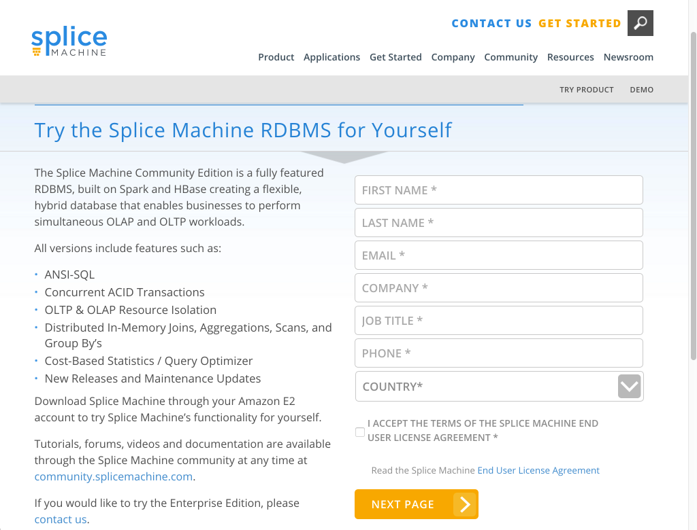

Click the <span class="AppCommand">NEXT PAGE</span> button to proceed and configure your cluster.

Configure Your Cluster
----------------------

AWS provides numerous choices for configuring your sandbox; Splice Machine recommends a minimum configuration such as the following:

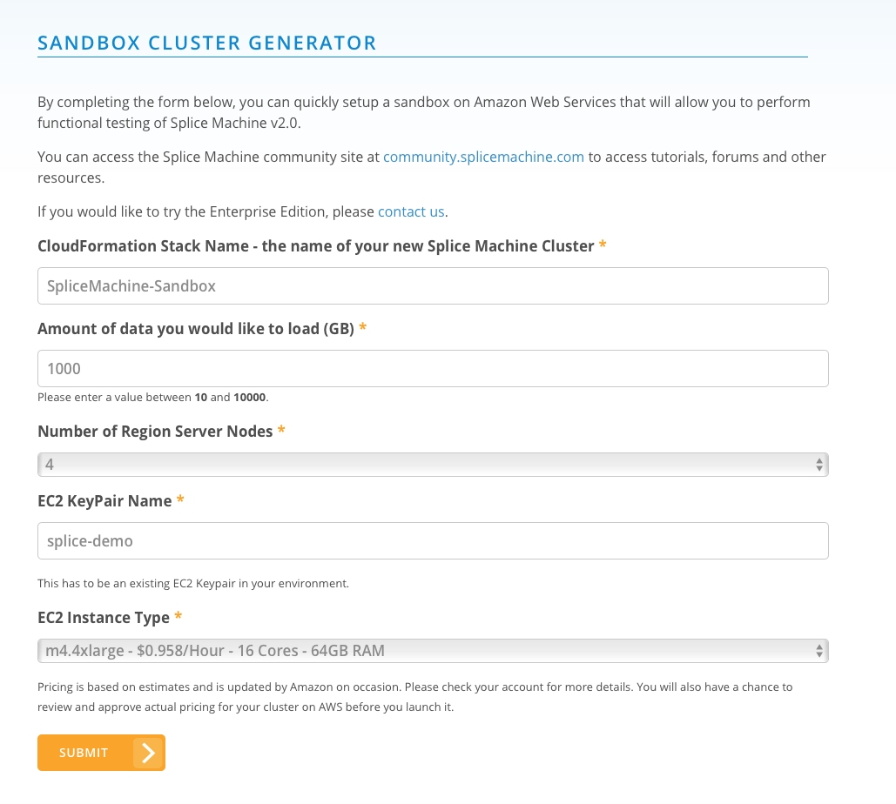

<span class="autonumber"><span class="noteAutoNum">NOTE:  </span></span>The EC2 KeyPair Name of your pem file, which can be located anywhere on your computer.
When specifying your EC2 KeyPair name, <span class="BoldFont">DO NOT</span> include any file name suffix. For example, enter <span class="CodeFont">splice-demo</span>, NOT <span class="CodeFont">splice-demo.pem</span>.

When you click the <span class="AppCommand">SUBMIT</span> button, Splice Machine generates an AWS cluster generator template file, which is a <span class="CodeFont">json</span> file that you can download for safekeeping.

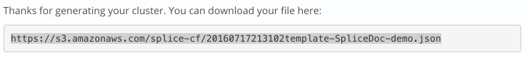

Before launching your cluster, select in which AWS region you want your cluster located:

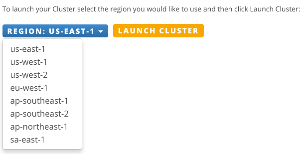

Click the <span class="AppCommand">LAUNCH CLUSTER</span> button to proceed to finalizing your sandbox template.

Finalize Your Sandbox Stack Template
------------------------------------

Your sandbox stack template file should already be entered into the Amazon S3 template field at the bottom of the screen; if you're using a different template file, you can select that instead; this is <span class="important">NOT RECOMMENDED</span>.

### Select Your Sandbox Template

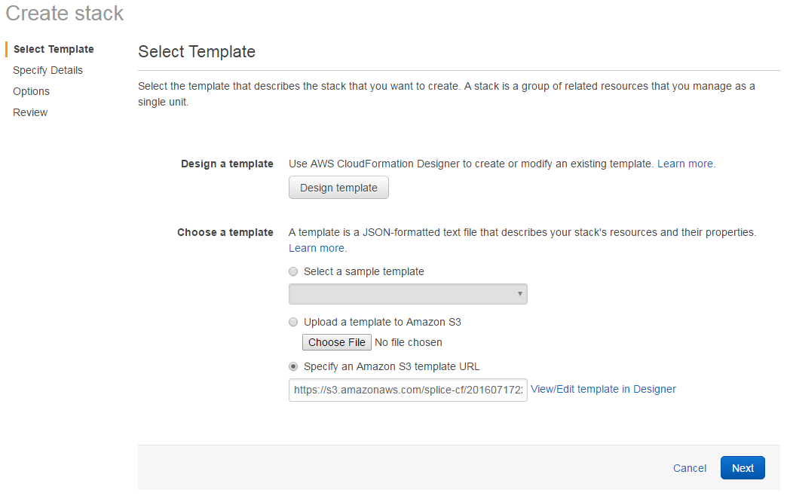

Click the <span class="AppCommand">Next</span> button to proceed to the <span class="ItalicFont">Specify Details</span> screen.

### Rename Your Stack if Desired

You set up a name for your stack at the beginning of this process; however, you can change that here if you want. Then click <span class="AppCommand">Next</span> to continue on to the <span class="ItalicFont">Options</span> screen.

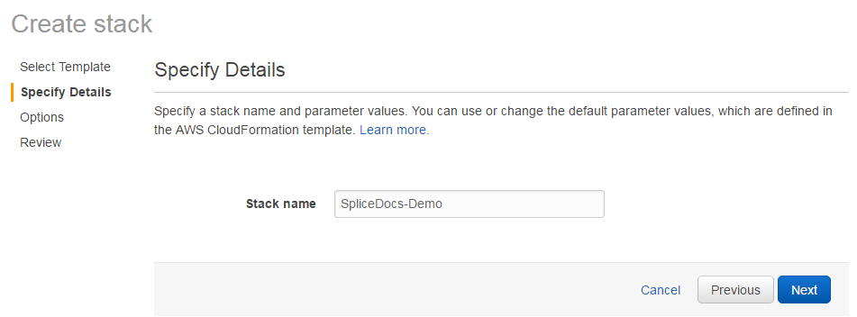

### Specify Options for Your Stack

In the <span class="ItalicFont">Options</span> screen, you can add tags and set advanced options for your sandbox stack.

#### Adding Resource Tags to the Stack, if Desired

You can optionally tag your sandbox stack with whatever key values you want. For example:

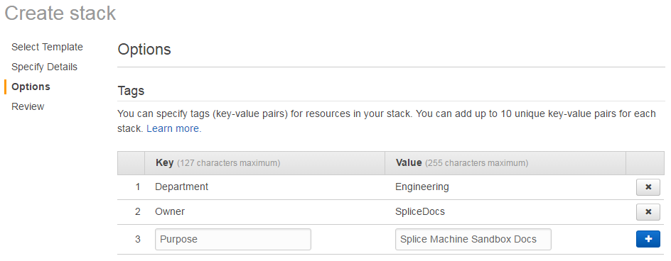

#### Setting Advanced Options for Your Stack

You can also configure advanced options for your sandbox stack in the <span class="ItalicFont">Options</span> screen, including notification, failure rollback, and policy options. For more information about these options, click the <span class="AppCommand">Learn more</span> button.

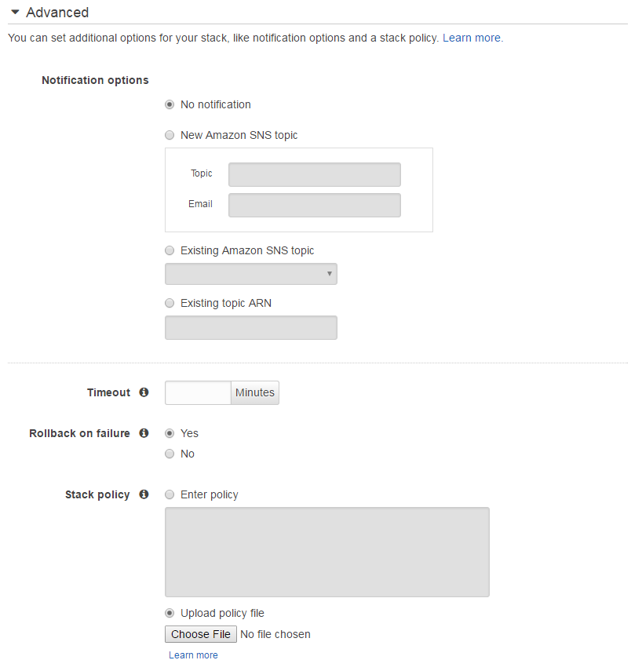

Click the <span class="AppCommand">Next</span> button at the bottom of the <span class="ItalicFont">Options</span> screen to proceed to the <span class="ItalicFont">Review</span> screen.

### Review Your Sandbox Stack Configuration

Finally, review your stack configuration, and then click the <span class="AppCommand">Create</span> button to start creating your sandbox cluster.

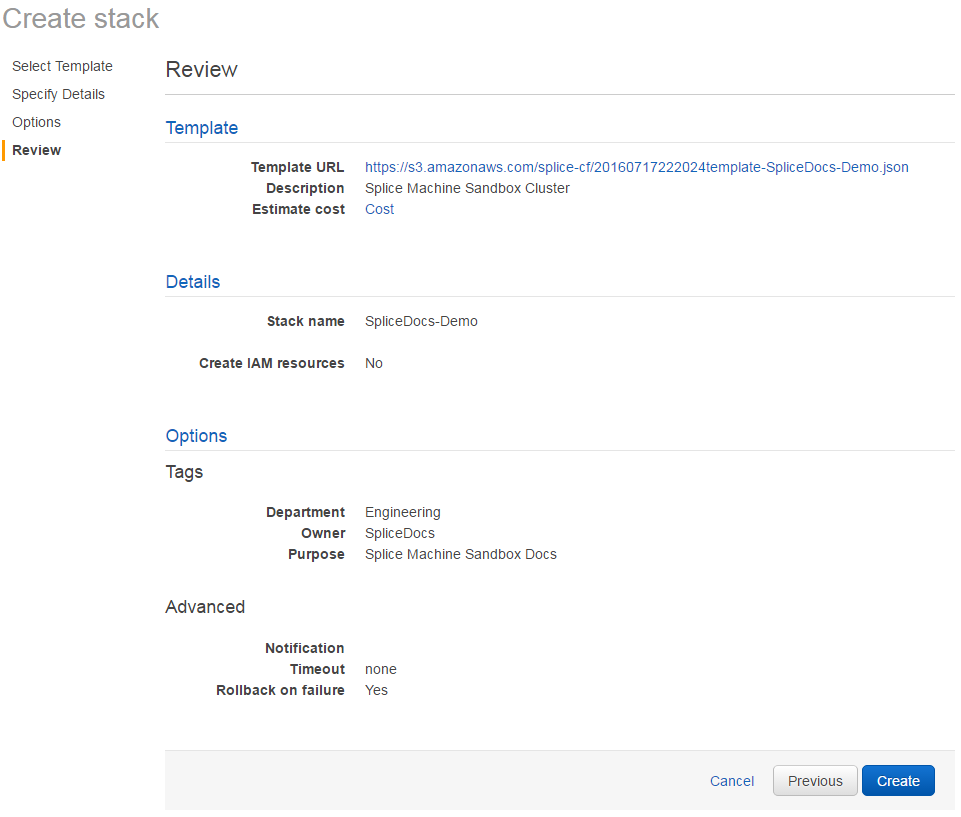

Finish Launching Your Cluster
-----------------------------

When AWS starts creating your cluster, you'll see a progress screen like this:

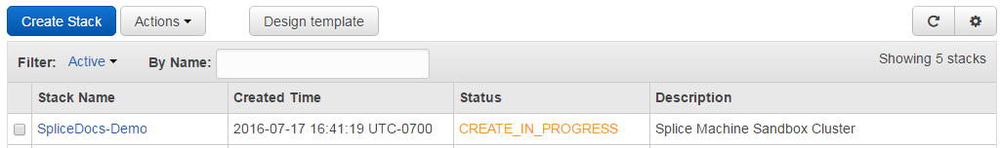

Depending on your configuration, the cluster may take some time to create. When it finishes, you'll see that the status has changed to complete:

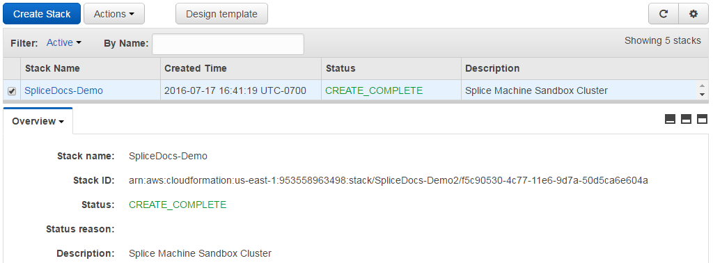

After the status changes to complete, you can display your nodes by clicking the stack name link, and then viewing <span class="ItalicFont">Outputs</span>, which will look something like this:

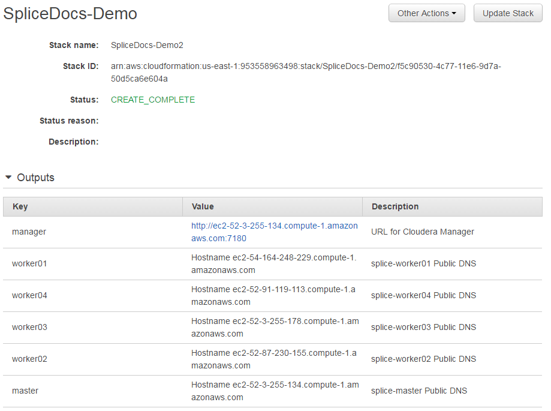

Use Cloudera to Manage your Cluster
-----------------------------------

You can now log into Cloudera Manager for your cluster by clicking the manager link shown in the <span class="ItalicFont">Outputs</span> screen, which lands you on the login screen:

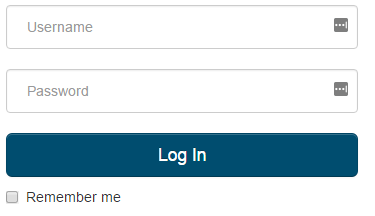.

After logging in, you can use Cloudera to manage your Splice Machine cluster.

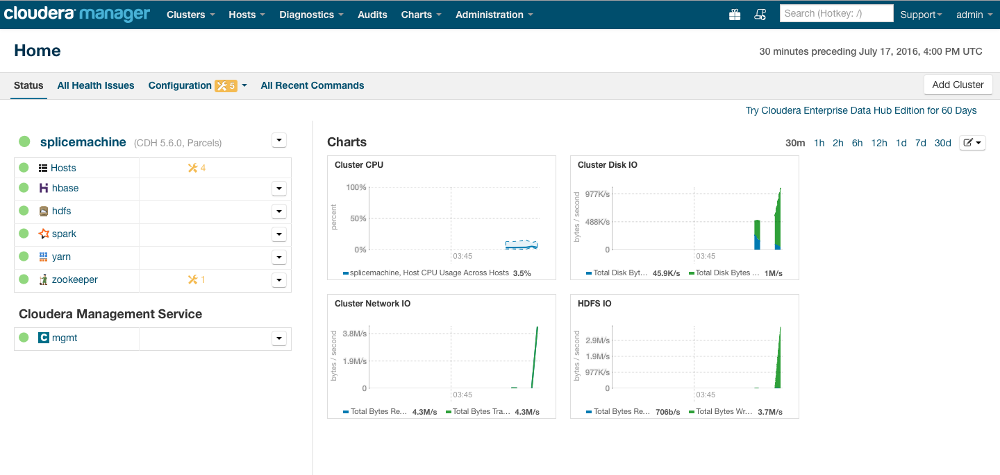

Using Splice Machine with Linux
-------------------------------

You can now log into one of your sandbox nodes and use Splice Machine from a terminal window on your computer. To do so, <span class="CodeFont">ssh</span> into the address of the node, which you can see in the Outputs screen from when you created the sandbox, or by viewing your cluster hosts in Cloudera Manager.

Make sure that you include the full name of your EC2 KeyPair when connecting. For example:

``` ShellCommand
ssh -i ~/Downloads/splice-demo.pem.txt centos@ec2-54-164-248-229.compute-1.amazonaws.com
```

Once you're connected to Splice Machine, you can work with your database. For example:

``` Example
~$ ssh -i ~/Downloads/splice-demo.pem.txt centos@ec2-54-164-248-229.compute-1.amazonaws.com
Last login: Sun Jul 17 23:58:17 2016 from 10.250.0.10
[centos@ip-10-250-0-11 ~]$ sqlshell.sh

 ========= rlwrap detected and enabled.  Use up and down arrow keys to scroll through command line history. ======== 

Running Splice Machine SQL shell
For help: "splice> help;"
SPLICE* - jdbc:splice://localhost:1527/splicedb
* = current connection
splice> show tables;
TABLE_SCHEM   |TABLE_NAME                |CONGLOM_ID|REMARKS
-----------------------------------------------------------------
SYS           |SYSALIASES                |272       |
SYS           |SYSBACKUP                 |912       |
SYS           |SYSBACKUPFILESET          |1024      |
SYS           |SYSBACKUPITEMS            |1200      |
SYS           |SYSBACKUPJOBS             |1232      |
SYS           |SYSCHECKS                 |288       |
SYS           |SYSCOLPERMS               |688       |
SYS           |SYSCOLUMNS                |80        |
SYS           |SYSCOLUMNSTATS            |1280      |
SYS           |SYSCONGLOMERATES          |48        |
SYS           |SYSCONSTRAINTS            |256       |
SYS           |SYSDEPENDS                |304       |
SYS           |SYSFILES                  |336       |
SYS           |SYSFOREIGNKEYS            |352       |
SYS           |SYSKEYS                   |240       |
SYS           |SYSPERMS                  |864       |
SYS           |SYSPHYSICALSTATS          |1296      |
SYS           |SYSPRIMARYKEYS            |368       |
SYS           |SYSROLES                  |800       |
SYS           |SYSROUTINEPERMS           |704       |
SYS           |SYSSCHEMAS                |32        |
SYS           |SYSSEQUENCES              |816       |
SYS           |SYSSTATEMENTS             |384       |
SYS           |SYSTABLEPERMS             |640       |
SYS           |SYSTABLES                 |64        |
SYS           |SYSTABLESTATS             |1312      |
SYS           |SYSTRIGGERS               |576       |
SYS           |SYSUSERS                  |880       |
SYS           |SYSVIEWS                  |320       |
SYSIBM        |SYSDUMMY1                 |1328      |

30 rows selected
splice> 
```

 


