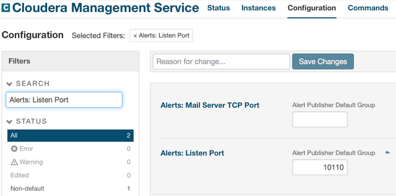

[Open topic with navigation](../../index.html#OnPremise/InstallingSpliceMachine/CDHInstall.html)

[]()Installing and Configuring Splice Machine for Cloudera Manager
==================================================================

This topic describes installing and configuring Splice Machine on a Cloudera-managed cluster. Follow these steps:

1.  [Verify Prerequisites](#Verify)
2.  [Download and Install Splice Machine](#Install)
3.  <a href="#Stop" class="WithinBook">Stop Hadoop Services</a>
4.  [Make Cluster Modifications for Splice Machine](#ClusterMod)
5.  [Configure Hadoop Services](#Configur8)
6.  Make any needed [Optional Configuration Modifications](#Optional)
7.  [Deploy the Client Configuration](#Deploy)
8.  [Restart the Cluster](#Restart)
9.  [Verify your Splice Machine Installation](#Run)

[]()Verify Prerequisites
------------------------

Before starting your Splice Machine installation, please make sure that your cluster contains the prerequisite software components:

-   A cluster running Cloudera Data Hub (CDH) with Cloudera Manager (CM)
-   HBase installed
-   HDFS installed
-   YARN installed
-   ZooKeeper installed
-   Ensure that Spark services are <span class="BoldFont">NOT</span> installed on your cluster; Splice Machine cannot currently coexist with Spark 1.x on a cluster.

<span class="autonumber"><span class="noteAutoNum">NOTE:  </span></span>The specific versions of these components that you need depend on your operating environment, and are called out in detail in the [Requirements](../GettingStarted/Requirements.html) topic of our <span class="ItalicFont">Getting Started Guide</span>.

[]()Download and Install Splice Machine
---------------------------------------

Use Cloudera Manager to download

Follow these steps to install CDH, Hadoop, Hadoop services, and Splice Machine on your cluster:

1.  Contact Splice Machine for your installer

    You'll need to get the URL of your Splice Machine installer (gzip) package; the actual URL you use will depend on which Splice Machine version you're installing and which version of HDP you are using. Here are typical URLs for Splice Machine Release <span class="BasicVariablesSpliceReleaseVersion">2.5</span>:

    | CDH Version                                                | Installer Package URL                                                                                                                                                                                                                                                               |
    |------------------------------------------------------------|-------------------------------------------------------------------------------------------------------------------------------------------------------------------------------------------------------------------------------------------------------------------------------------|
    | <span class="InstallerVersionsCDH-R1Name">CDH 5.7.2</span> | <span class="InstallerVersionsAWSS3Bucket">https://s3.amazonaws.com/splice-releases</span>/<span class="InstallerVersionsCurrentRelease">2.5.0.1707</span>/<span class="InstallerVersionsAWSParcelPart">cluster/parcel</span>/<span class="InstallerVersionsCDH-R1">cdh5.7.2</span> |
    | <span class="InstallerVersionsCDH-R2Name">CDH 5.8.0</span> | <span class="InstallerVersionsAWSS3Bucket">https://s3.amazonaws.com/splice-releases</span>/<span class="InstallerVersionsCurrentRelease">2.5.0.1707</span>/<span class="InstallerVersionsAWSParcelPart">cluster/parcel</span>/<span class="InstallerVersionsCDH-R2">cdh5.8.0</span> |
    | <span class="InstallerVersionsCDH-R3Name">CDH 5.8.3</span> | <span class="InstallerVersionsAWSS3Bucket">https://s3.amazonaws.com/splice-releases</span>/<span class="InstallerVersionsCurrentRelease">2.5.0.1707</span>/<span class="InstallerVersionsAWSParcelPart">cluster/parcel</span>/<span class="InstallerVersionsCDH-R3">cdh5.8.3</span> |

    To be sure that you have the latest URL, please check [the Splice Machine Community site](https://community.splicemachine.com/) or contact your Splice Machine representative.

2.  Add the parcel repository:

    Now select your repository in the Cloudera Manager <span class="ItalicFont">Select Repository</span> screen.

    1.  Make sure the <span class="AppCommand">Use Parcels (Recommended)</span> option and the <span class="AppCommand">Matched release</span> option are both selected.
    2.  Click the <span class="AppCommand">Continue</span> button to land on the <span class="ItalicFont">More Options</span> screen.
    3.  Cick the <span class="AppCommand">+</span> button for the <span class="AppCommand">Remote Parcel Repository URLs</span> field. Paste your Splice Machine repository URL into this field.

3.  Use Cloudera Manager to install the parcel.

4.  Verify that the parcel has been distributed and activated.

    The Splice Machine parcel is identified as <span class="CodeFont">SPLICEMACHINE</span> in the Cloudera Manager user interface. Make sure that this parcel has been downloaded, distributed, and activated on your cluster.

5.  Restart and redeploy any client changes when Cloudera Manager prompts you.

[]()Stop Hadoop Services
------------------------

As a first step, we stop cluster services to allow our installer to make changes that require the cluster to be temporarily inactive.

From the Cloudera Manager home screen, click the drop-down arrow next to the cluster on

1.  Select your cluster in Cloudera Manager

    Click the drop-down arrow next to the name of the cluster on which you are installing Splice Machine.

2.  Stop the cluster

    Click the <span class="AppCommand">Stop</span> button.

[]()Make Cluster Modifications for Splice Machine
-------------------------------------------------

Splice Machine requires a few modifications at the file system level to work properly on a CDH cluster:

1.  Install updated Java Servlet library:

    You need to install an updated <span class="AppFontCustCode">javax.servlet-api</span> library so that Splice Machine can use Spark 2.0.x functionality in YARN.

2.  Remove Spark 1.6.x libraries

    To avoid Spark version mismatches, you must remove all Spark 1.6.x libraries from <span class="CodeFont">/opt/cloudera/parcels/CDH/jars/</span>.

3.  Run our script as <span class="ItalicFont">root</span> user <span class="important">on each node</span> in your cluster to add symbolic links to the Splice Machine uber jar and YARN proxy jar into the YARN directories

    Issue this command <span class="important">on each node</span> in your cluster::

    ``` AppCommand
    sudo /opt/cloudera/parcels/SPLICEMACHINE/scripts/install-splice-symlinks.sh
    ```

[]()Configure Hadoop Services
-----------------------------

Now it's time to make a few modifications in the Hadoop services configurations:

-   [Configure and Restart the Management Service](#Configur)
-   [Configure ZooKeeper](#Configur4)
-   [Configure HDFS](#Configur5)
-   [Configure YARN](#Configur2)
-   [Configure HBASE](#Configur3)

### []()Configure and Restart the Management Service

1.  Select the <span class="AppCommand">Configuration</span> tab in CM:

    

2.  Change the value of the Alerts: Listen Port to to <span class="AppFontCustCode">10110</span>.
3.  Save changes and restart the Management Service.

### []()Configure ZooKeeper

To edit the ZooKeeper configuration, click <span class="AppCommand">ZooKeeper</span> in the Cloudera Manager (CM) home screen, then click the <span class="AppCommand">Configuration</span> tab and follow these steps:

1.  Select the <span class="AppCommand">Service-Wide</span> category.

    Make the following changes:

    ``` AppCommand
    Maximum Client Connections = 0
    Maximum Session Timeout    = 120000
    ```

    Click the <span class="AppCommand">Save Changes</span> button.

### []()Configure HDFS

To edit the HDFS configuration, click <span class="AppCommand">HDFS</span> in the Cloudera Manager home screen, then click the <span class="AppCommand">Configuration</span> tab and make these changes:

1.  Verify that the HDFS data directories for your cluster are set up to use your data disks.

2.  Change the values of these settings

    | Setting                             | New Value |
    |-------------------------------------|-----------|
    | Handler Count                       | 20        |
    | Maximum Number of Transfer Threads  | 8192      |
    | NameNodeHandler Count               | 64        |
    | NameNode Service Handler Count      | 60        |
    | Replication Factor                  | 2 or 3 \* |
    | Java Heap Size of DataNode in Bytes | 2 GB      |

3.  Click the <span class="AppCommand">Save Changes</span> button.

### []()Configure YARN

To edit the YARN configuration, click <span class="AppCommand">YARN</span> in the Cloudera Manager home screen, then click the <span class="AppCommand">Configuration</span> tab and make these changes:

1.  Verify that the following directories are set up to use your data disks.

    |                               |
    |-------------------------------|
    | NodeManager Local Directories 
     NameNode Data Directories      
     HDFS Checkpoint Directories    |

2.  Change the values of these settings

    | Setting                             | New Value                   |
    |-------------------------------------|-----------------------------|
    | Heartbeat Interval                  | 100 ms                      |
    | MR Application Classpath            |                             |
    | YARN Application Classpath          |                             |
    | Localized Dir Deletion Delay        | 86400                       |
    | JobHistory Server Max Log Size      | 1 GB                        |
    | NodeManager Max Log Size            | 1 GB                        |
    | ResourceManager Max Log Size        | 1 GB                        |
    | Container Memory                    | 30 GB (based on node specs) |
    | Container Memory Maximum            | 30 GB (based on node specs) |
    | Container Virtual CPU Cores         | 19 (based on node specs)    |
    | Container Virtual CPU Cores Maximum | 19 (Based on node specs)    |

3.  Add property values

    You need to add the same two property values to each of four YARN advanced configuration settings.

    Add these properties:

    | XML Property Name                                  | XML Property Value                               |
    |----------------------------------------------------|--------------------------------------------------|
    | yarn.nodemanager.aux-services.spark\_shuffle.class | org.apache.spark.network.yarn.YarnShuffleService |
    | yarn.nodemanager.aux-services                      | mapreduce\_shuffle,spark\_shuffle                |

    To each of these YARN settings:

    -   Yarn Service Advanced Configuration Snippet (Safety Valve) for yarn-site.xml
    -   Yarn Client Advanced Configuration Snippet (Safety Valve) for yarn-site.xml
    -   NodeManager Advanced Configuration Snippet (Safety Valve) for yarn-site.xml
    -   ResourceManager Advanced Configuration Snippet (Safety Valve) for yarn-site.xml

4.  Click the <span class="AppCommand">Save Changes</span> button.

### []()Configure HBASE

To edit the HBASE configuration, click <span class="AppCommand">HBASE</span> in the Cloudera Manager home screen, then click the <span class="AppCommand">Configuration</span> tab and make these changes:

1.  Change the values of these settings

    | Setting                                                                        | New Value                                                                                                     |
    |--------------------------------------------------------------------------------|---------------------------------------------------------------------------------------------------------------|
    | HBase Client Scanner Caching                                                   | 100 ms                                                                                                        |
    | Graceful Shutdown Timeout                                                      | 30 seconds                                                                                                    |
    | HBase Service Advanced Configuration Snippet (Safety Valve) for hbase-site.xml | <span class="bodyFont">The property list for the Safety Valve snippet is shown below, in Step 2</span>        |
    | SplitLog Manager Timeout                                                       | 5 minutes                                                                                                     |
    | Maximum HBase Client Retries                                                   | 40                                                                                                            |
    | RPC Timeout                                                                    | 20 minutes (or 1200000 milliseconds)                                                                          |
    | HBase Client Pause                                                             | 90                                                                                                            |
    | ZooKeeper Session Timeout                                                      | 120000                                                                                                        |
    | HBase Master Web UI Port                                                       | 16010                                                                                                         |
    | HBase Master Port                                                              | 16000                                                                                                         |
    | Java Configuration Options for HBase Master                                    | <span class="bodyFont">The HBase Master Java configuration options list is shown below, in Step 3</span>      |
    | HBase Coprocessor Master Classes                                               | com.splicemachine.hbase.SpliceMasterObserver                                                                  |
    | Java Heap Size of HBase Master in Bytes                                        | 5 GB                                                                                                          |
    | HStore Compaction Threshold                                                    | 5                                                                                                             |
    | HBase RegionServer Web UI port                                                 | 16030                                                                                                         |
    | HStore Blocking Store Files                                                    | 20                                                                                                            |
    | Java Configuration Options for HBase RegionServer                              | <span class="bodyFont">The HBase RegionServerJava configuration options list is shown below, in Step 4</span> |
    | HBase Memstore Block Multiplier                                                | 4                                                                                                             |
    | Maximum Number of HStoreFiles Compaction                                       | 7                                                                                                             |
    | HBase RegionServer Lease Period                                                | 20 minutes (or 1200000 milliseconds)                                                                          |
    | HFile Block Cache Size                                                         | 0.25                                                                                                          |
    | Java Heap Size of HBase RegionServer in Bytes                                  | 24 GB                                                                                                         |
    | HBase RegionServer Handler Count                                               | 200                                                                                                           |
    | HBase RegionServer Meta-Handler Count                                          | 200                                                                                                           |
    | HBase Coprocessor Region Classes                                               | com.splicemachine.hbase.MemstoreAwareObserver                                                                 
                                                                                      com.splicemachine.derby.hbase.SpliceIndexObserver                                                              
                                                                                      com.splicemachine.derby.hbase.SpliceIndexEndpoint                                                              
                                                                                      com.splicemachine.hbase.RegionSizeEndpoint                                                                     
                                                                                      com.splicemachine.si.data.hbase.coprocessor.TxnLifecycleEndpoint                                               
                                                                                      com.splicemachine.si.data.hbase.coprocessor.SIObserver                                                         
                                                                                      com.splicemachine.hbase.BackupEndpointObserver                                                                 |
    | Maximum number of Write-Ahead Log (WAL) files                                  | 48                                                                                                            |
    | RegionServer Small Compactions Thread Count                                    | 4                                                                                                             |
    | HBase RegionServer Port                                                        | 16020                                                                                                         |
    | Per-RegionServer Number of WAL Pipelines                                       | 16                                                                                                            |

2.  []()Set the value of <span class="CodeFont">HBase Service Advanced Configuration Snippet (Safety Valve)</span> for <span class="CodeFont">hbase-site.xml</span>:

3.  Set the value of Java Configuration Options for HBase Master:

4.  Set the value of Java Configuration Options for Region Servers:

5.  Click the <span class="AppCommand">Save Changes</span> button.

[]()Optional Configuration Modifications
----------------------------------------

There are a few configuration modifications you might want to make:

-   [Modify the Authentication Mechanism](#Modify) if you want to authenticate users with something other than the default <span class="ItalicFont">native authentication</span> mechanism.

### []()Modify the Authentication Mechanism

Splice Machine installs with Native authentication configured; native authentication uses the <span class="CodeFont">sys.sysusers</span> table in the <span class="CodeFont">splice</span> schema for configuring user names and passwords.

You can disable authentication or change the authentication mechanism that Splice Machine uses to LDAP by following the simple instructions in [Configuring Splice Machine Authentication](Authentication.html)

[]()Deploy the Client Configuration
-----------------------------------

Now that you've updated your configuration information, you need to deploy it throughout your cluster. You should see a small notification in the upper right corner of your screen that looks like this:


To deploy your configuration:

1.  Click the notification.
2.  Click the <span class="AppCommand">Deploy Client Configuration</span> button.
3.  When the deployment completes, click the <span class="AppCommand">Finish</span> button.

[]()Restart the Cluster
-----------------------

As a first step, we stop the services that we're about to configure from the Cloudera Manager home screen:

1.  Restart ZooKeeper

    Select <span class="AppCommand">Start</span> from the <span class="AppCommand">Actions</span> menu in the upper right corner of the ZooKeeper <span class="AppCommand">Configuration</span> tab to restart ZooKeeper.

2.  Restart HDFS

    Click the <span class="AppCommand">HDFS Actions</span> drop-down arrow associated with (to the right of) HDFS in the cluster summary section of the Cloudera Manager home screen, and then click <span class="AppCommand">Start</span> to restart HDFS.

    Use your terminal window to create these directories (if they are not already available in HDFS):

    ``` ShellCommand
    sudo -iu hdfs hadoop fs -mkdir -p hdfs:///user/hbase hdfs:///user/splice/history
    sudo -iu hdfs hadoop fs -chown -R hbase:hbase hdfs:///user/hbase hdfs:///user/splice
    sudo -iu hdfs hadoop fs -chmod 1777 hdfs:///user/splice hdfs:///user/splice/history
    ```

3.  Restart YARN

    Click the <span class="AppCommand">YARN Actions</span> drop-down arrow associated with (to the right of) YARN in the cluster summary section of the Cloudera Manager home screen, and then click <span class="AppCommand">Start</span> to restart YARN.

4.  Restart HBase

    Click the <span class="AppCommand">HBASE Actions</span> drop-down arrow associated with (to the right of) HBASE in the cluster summary section of the Cloudera Manager home screen, and then click <span class="AppCommand">Start</span> to restart HBase.

[]()Verify your Splice Machine Installation
-------------------------------------------

Now start using the Splice Machine command line interpreter, which is referred to as <span class="ItalicFont">the splice prompt</span> or simply <span class="AppCommand">splice&gt;</span> by launching the <span class="CodeFont">sqlshell.sh</span> script on any node in your cluster that is running an HBase region server.

<span class="autonumber"><span class="noteAutoNum">NOTE:  </span></span>The command line interpreter defaults to connecting on port <span class="CodeFont">1527</span> on <span class="CodeFont">localhost</span>, with username <span class="CodeFont">splice</span>, and password <span class="CodeFont">admin</span>. You can override these defaults when starting the interpreter, as described in the [Command Line (splice&gt;) Reference](../../Shared/CmdLineReference/Intro.CmdLineReference.html) topic in our <span class="ItalicFont">Developer's Guide</span>.

Now try entering a few sample commands you can run to verify that everything is working with your Splice Machine installation.

Operation
Command to perform operation
Display tables
``` AppCommandCell
splice> show tables;
```

Create a table
``` AppCommandCell
splice> create table test (i int);
```

Add data to the table
``` AppCommandCell
splice> insert into test values 1,2,3,4,5;
```

Query data in the table
``` AppCommandCell
splice> select * from test;
```

Drop the table
``` AppCommandCell
splice> drop table test;
```

List available commands
``` AppCommandCell
splice> help;
```

Exit the command line interpreter
``` AppCommandCell
splice> exit;
```

<span class="BoldFont">Make sure you end each command with a semicolon</span> (<span class="CodeFont">;</span>), followed by the <span class="ItalicFont">Enter</span> key or <span class="ItalicFont">Return</span> key
See the [Command Line (splice&gt;) Reference](../../Shared/CmdLineReference/Intro.CmdLineReference.html) section of our <span class="ItalicFont">Developer's Guide</span> for information about our commands and command syntax.

 


