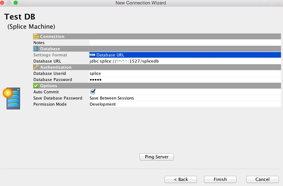
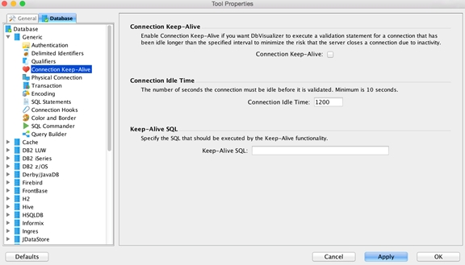

[Open topic with navigation](../../../index.html#Shared/Developers/Connecting/DBVisualizer.html)

Connecting DbVisualizer with JDBC
=====================================

This topic describes how to connect the DbVisualizer database visualization tool to Splice Machine via JDBC, in these three steps:

1.  [Download DbVisualizer](#Download)
2.  [Set up the Splice Machine driver](#Set)
3.  [Create a connection between DbVisualizer and Splice Machine](#Create)

Download DbVisualizer
-------------------------

You can download a free version of DbVisualizer from <http://www.dbvis.com>; make sure that you have the latest version. After downloading, install the product on your computer, which provides excellent installation help if you encounter any difficulties.

Set up the Splice Machine Driver
------------------------------------

Follow the steps to create and configure the Splice Machine driver:

1.  Start DbVisualizer
2.  Select Tools | Driver Manager from DbVisualizer's top menu.
3.  Create a new driver in DbVisualizer:

    1.  Click the first icon at the top (the plus sign) to configure a new driver.
    2.  Enter the following values in the Driver Settings section to use our JDBC driver.

        IMPORTANT:  You must use the Splice Machine JDBC driver; other drivers will not work correctly.

        |               |                                                         |
        |---------------|---------------------------------------------------------|
        | Name:         | Splice Machine                                          |
        | URL Format:   | jdbc:splice://&lt;server&gt;:&lt;port:1527&gt;/splicedb |
        | Driver Class: | com.splicemachine.db.jdbc.ClientDriver                  |

        

Create a Connection
-----------------------

Follow the steps in this section to create a connection and start using DbVisualizer with Splice Machine. See the [DbVisualizer User's Guide](http://confluence.dbvis.com/display/HOME/Documentation+Home) for complete information about creating connections.

1.  If you've not already done so, start DbVisualizer
2.  Start the New Connection wizard:

    Start the connection wizard by clicking Create Database Connection in the Database menu.

    Click the Use Wizard button.

3.  Name your connection:

    Enter a name for the connection on the first Wizard page. For example, you might name it Splice Machine Connection.

    Click the Next button in the Wizard.

4.  Select the driver:

    Select Splice Machine as the Database Driver.

    Then click the Next button again.

5.  Set up the connection:

    Fill in the fields in the connection wizard screen using these values:

    |                    |                                               |
    |--------------------|-----------------------------------------------|
    | Database URL:      | &lt;your Splice Machine database URL&gt;      |
    | Database Userid:   | &lt;your Splice Machine database user ID&gt;  |
    | Database Password: | &lt;your Splice Machine database password&gt; |

    

6.  Click the Ping Server button to verify that your connection can be established.

    Splice Machine must be running for the connection to be successful.

7.  Click the Finish button to create the connection.

8.  Optionally set additional settings:

    You may want to configure some additional settings. For example, to control the timeout duration, use these steps:

    1.  Select Tools | Tools Properties from the top DBVisualizer menu.
    2.  Select Generic | Connection Keep-Alive from the Database tab.
    3.  Enter values for your connection.

        

Your connection is now listed in the left panel under Connections. You can use it to explore the database schema, enter queries, and take advantage of all of the capabilities of DBVisualizer.

IMPORTANT:  DbVisualizer's SQL Commander menu includes an option to Strip Comments when Executing. If you enable this option, any Splice Machine query hints that you use will be stripped out and won't be applied.

 

