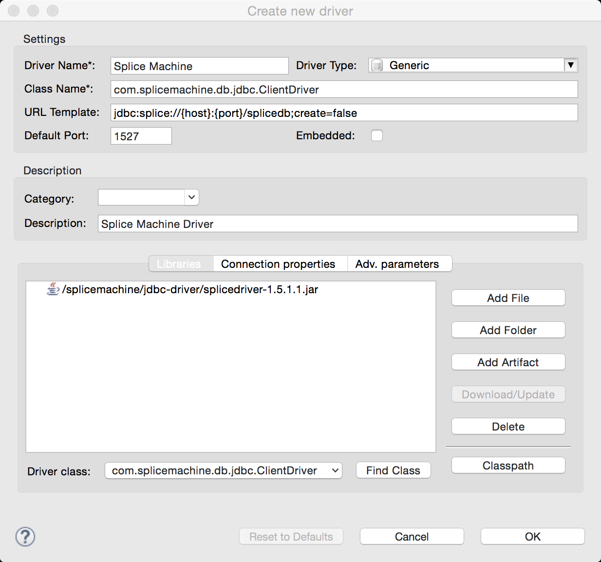
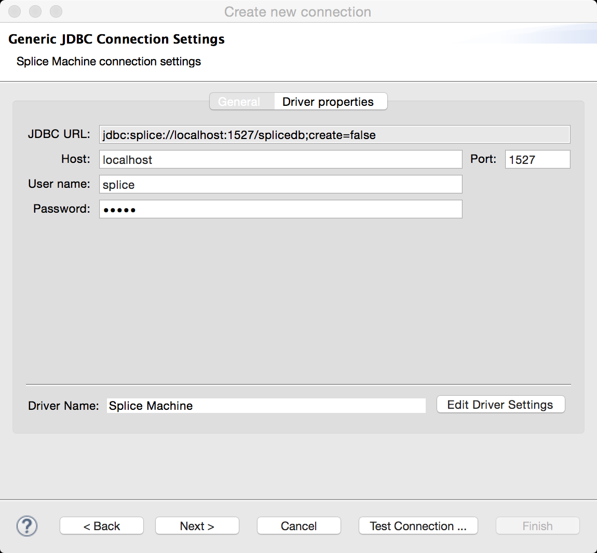
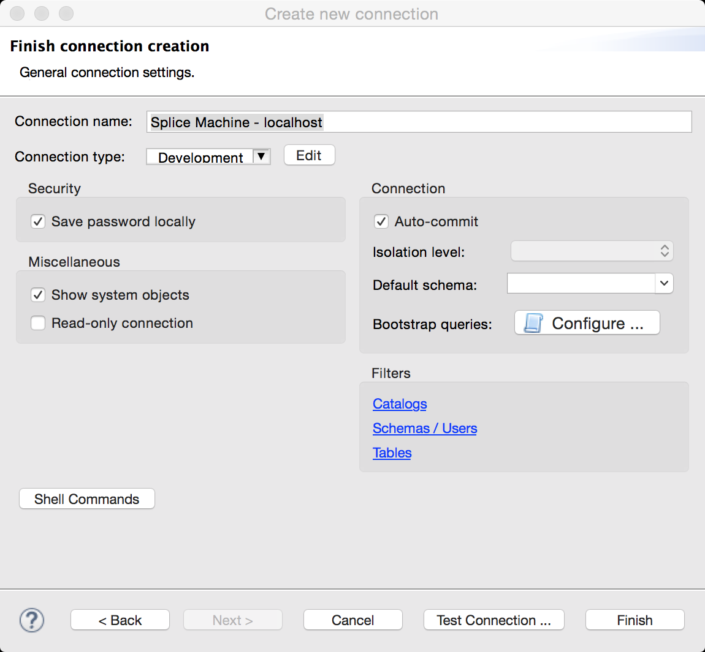
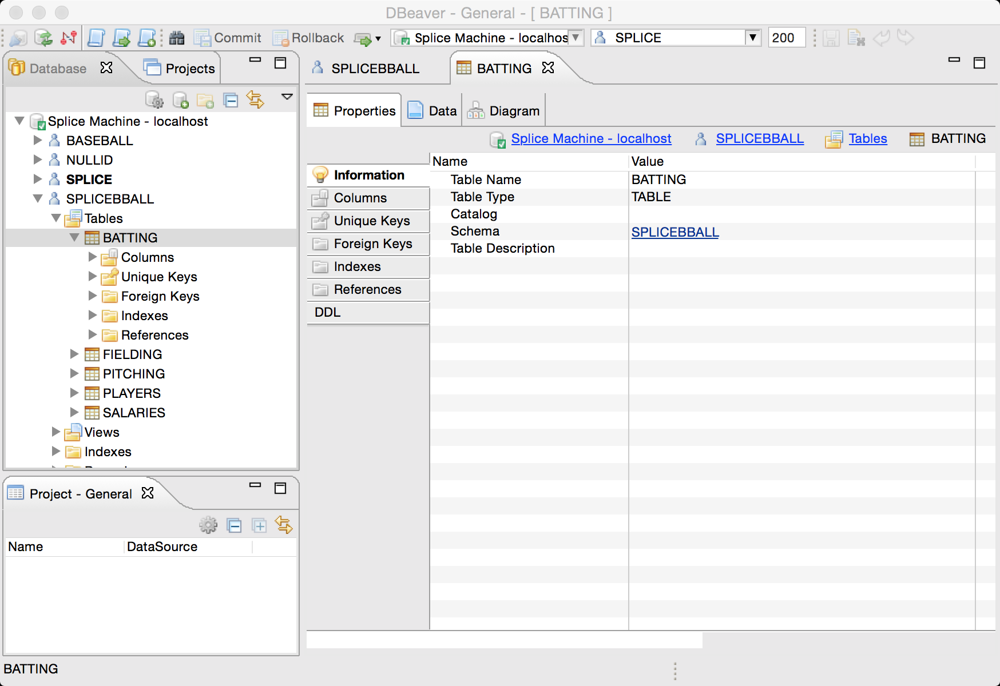

[Open topic with navigation](../../../index.html#Shared/Developers/Connecting/DBeaverSetup.html)

Using DBeaver with Splice Machine
=================================

This topic walks you through installing and configuring DBeaver SQL Client for use with your Splice Machine database, in the following sections:

-   [About the DBeaver Client](#About)
-   [Installing the DBeaver SQL Client](#Installi)
-   [Configuring DBeaver for Splice Machine](#Configur)
-   [Using DBeaver with Splice Machine](#Using)

[]()About the DBeaver Client
----------------------------

The <span class="ItalicFont">DBeaver Client</span> is a graphical SQL client written in Java that allows you to:

-   view the structure of a JDBC compliant database
-   browse the data in tables
-   issue SQL commands

[]()Installing the DBeaver Client
---------------------------------

This section presents installation instructions for the DBeaver Client for for [MacOS](#MacOS) and [Windows](#PC) computers.

### []()Installing the DBeaver Client on MacOS

Follow these steps to download and install DBeaver on your MacOS computer:

1.  Download the installer:

    Download the DBeaver for MacOS zip archive from <http://dbeaver.jkiss.org/download/>.

    <span class="autonumber"><span class="noteAutoNum">NOTE:  </span></span>You must Java version 7.0 or higher installed to run DBeaver.

2.  Copy the application to your Applications folder:

    Double-click the file you downloaded and then copy the DBeaver.app to your Applications folder.

### []()Installing DBeaver on Windows

Follow these steps to install DBeaver on your Windows PC:

1.  Download the installer:

    Download the installer for the enterprise edition of DBeaver for Windows from <http://dbeaver.jkiss.org/download/>.

2.  Run the installer:

    Double-click the <span class="CodeFont">dbeaver-<span class="HighlightedCode">&lt;version&gt;</span>.exe</span> file that you downloaded to install DBeaver, using the installer's default values.

[]()Configuring DBeaver for Splice Machine
------------------------------------------

Before you can use DBeaver with Splice Machine, you must create a new driver definition in DBeaver for Splice Machine. Follow these steps:

1.  Find the Splice Machine JDBC Driver

    Make sure you can find our JDBC driver, which is installed on your computer when you install Splice Machine. You'll find it in the <span class="CodeFont">jdbc-driver</span> folder under the <span class="CodeFont">splicemachine</span> directory. Typical locations are:

    | OS      | Location                                                                                                   |
    |---------|------------------------------------------------------------------------------------------------------------|
    | MacOS   | \\splicemachine\\jdbc-driver\\<span class="PlatformVariablesJDBCDriverJar">db-client-2.0.1.18.jar</span>   |
    | Windows | C:\\splicemachine\\jdbc-driver\\<span class="PlatformVariablesJDBCDriverJar">db-client-2.0.1.18.jar</span> |

    You can also download the driver here:

    ``` Plain
    https://s3.amazonaws.com/splice-releases/2.0.1.18/jdbc-driver/db-client-2.0.1.18.jar
    ```

    <span class="autonumber"><span class="noteAutoNum">IMPORTANT:  </span></span>You <span class="BoldFont">must</span> use the <span class="ItalicFont">Splice Machine</span> JDBC or ODBC drivers; other drivers will not work correctly.

2.  Create a DBeaver driver definition for the Splice Machine driver:

    1.  Select <span class="AppCommand">Driver Manager</span> from the DBeaver <span class="AppCommand">Database</span> menu.
    2.  Click the <span class="AppCommand">New</span> button to create your new driver definition.
    3.  Populate the fields in the <span class="ItalicFont">Create new driver</span> screen as shown here in the following screen shot:

        <span class="autonumber"><span class="noteAutoNum">NOTE:  </span></span>You need to add the Splice Machine JDBC jar file in the definition: click the <span class="AppCommand">Add File</span> button and then navigate to where it is stored on your computer; for example:
               <span class="CodeFont">/splicemachine/jdbc-driver/<span class="PlatformVariablesJDBCDriverJar">db-client-2.0.1.18.jar</span></span>.

        

        <span class="autonumber"><span class="noteAutoNum">NOTE:  </span></span>To fill in the <span class="AppCommand">Driver class</span> field, click the <span class="AppCommand">Find Class</span> button and select the <span class="CodeFont">com.splicemachine.db.jdbc.ClientDriver</span>.

    4.  Click the <span class="AppCommand">OK</span> button to create your new driver definition.
    5.  Click the Close button to close the DBeaver Driver Manager screen.

3.  Create a DBeaver connection for your database:

    DBeaver uses pre-defined connections to access your database, so you need to create a connection for each database that you access, using the following steps:

    1.  Select <span class="AppCommand">New Connection</span> from the DBeaver <span class="AppCommand">Database</span> menu.

    2.  Select the <span class="AppCommand">Splice Machine</span> Driver connection type in the next screen, then click the <span class="AppCommand">Next</span> button:

        

    3.  Fill in the <span class="ItalicFont">Create new connection</span> screen as shown here:

        

        <span class="autonumber"><span class="noteAutoNum">NOTE:  </span></span>The default <span class="AppCommand">user</span> name is <span class="CodeFont">splice</span>, and the default <span class="AppCommand">password</span> is <span class="CodeFont">admin</span>.For <span class="AppCommand">Server</span>: on a cluster,specify the IP address of an HBase RegionServer. If you're running the standalone version of Splice Machine, specify <span class="CodeFont">localhost</span>.

    4.  We recommend testing the connection by clicking the <span class="AppCommand">Test Connection</span> button.

        Splice Machine must be running for a successful connection.

    5.  Click the <span class="AppCommand">Next</span> button. If you have VPN requirements, fill those in on the <span class="ItalicFont">Network Configuration</span> screen; otherwise, simply click the <span class="AppCommand">Next</span> button again.

    6.  In the <span class="ItalicFont">Finish connection creation</span> screen, enter a name for your connection and click the <span class="AppCommand">Finish</span> button.

        

[]()Using DBeaver with Splice Machine
-------------------------------------

Once you've finished adding the driver and connection, follow these steps to use DBeaver:

1.  Start the DBeaver client:

    Locate and run the DBeaver application if it's not already running.

2.  Navigate to your database:

    In the DBeaver <span class="ItalicFont">Database Navigator</span>, select the connection you want to use; in the example below, we're using the connection we just connected, which is named <span class="CodeFont">Splice Machine - localhost</span>.

3.  Select database objects:

    Expand the tree structure under your connection to expose the database objects that you want to explore:

    

 


