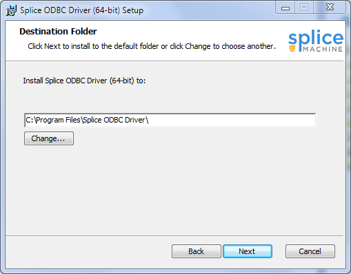
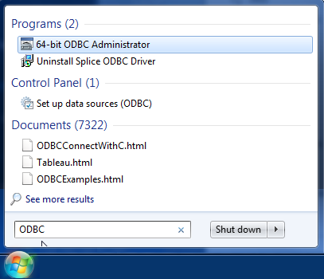
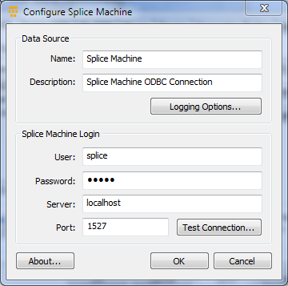

[Open topic with navigation](../../../index.html#Shared/Developers/Connecting/ODBCDriver.html)

Using the Splice Machine ODBC Driver[]()
========================================

This topic describes how to configure and use the Splice Machine ODBC driver, which you can use to connect with other databases and business tools that need to access your database.

<span class="autonumber"><span class="noteAutoNum">IMPORTANT:  </span></span>You <span class="BoldFont">must</span> use the <span class="ItalicFont">Splice Machine</span> ODBC driver; other drivers will not work correctly.

This topic describes how to install and configure the Splice Machine ODBC driver for these operating systems:

-   [Installing the Splice Machine ODBC Driver on Windows](#Installi)
-   [Installing the Splice Machine ODBC Driver on Linux](#Installi2)

This topic also includes an [example that illustrates using our ODBC driver](#Using) with the C language.

[]()Installing and Configuring the Driver on Windows
----------------------------------------------------

You can install the Windows version of the Splice Machine ODBC driver using the provided Windows installer (<span class="CodeFont">.msi</span> file); we provide both 64-bit and 32-bit versions of the driver. Follow these steps to install the driver:

1.  Download the installer:

    You can download the driver installer from [our ODBC download](https://www.splicemachine.com/get-started/odbc-driver-download/) site: 

    The file you download will have a name similar to these:

    -   splice\_odbc\_setup\_64bit\_1.0.28.0.msi
    -   splice\_odbc\_setup\_32bit\_1.0.28.0.msi

2.  Start the installer

    Double-click the installers <span class="CodeFont">.msi</span> file to start installation. You'll see the Welcome screen:

    

    Click the <span class="AppCommand">Next</span> button to proceed.

3.  Accept the license agreement.
4.  Select the destination folder for the driver

    The default destination is generally fine, but you can select a different location if you like:

    

    Click the <span class="AppCommand">Next</span> button to continue to the Ready to Install screen.

5.  Click install

    Click the <span class="AppCommand">Install</span> button on the Ready to install screen. Installation can take a minute or two to complete.

    <span class="autonumber"><span class="noteAutoNum">NOTE:  </span></span>The installer may notify you that you either need to stop certain software before continuing, or that you can continue and then reboot your computer after the installation completes.

6.  Finish the installation

    Click the Finish button, and you're ready to use the Splice Machine ODBC driver.

7.  Start the Windows ODBC Data Source Administrator tool

    You need to add our ODBC driver to the set of Windows ODBC data sources, using the Windows ODBC Data Source Administrator tool; You can read about this tool here: <https://msdn.microsoft.com/en-us/library/ms712362(v=vs.85).aspx>.

    You can find and start the Windows ODBC Administrator tool using a Windows search for ODBC on your computer; here's what it looks like on Windows 7:

    

8.  Add the Splice Machine driver as a data source

    Click the <span class="AppCommand">Add button</span> the User DSN tab of the ODBC Data Source Administrator screen, and then select the Splice Machine driver you just installed:

    

9.  Configure your new data source:

    When you click the <span class="AppCommand">Finish</span> button in the <span class="ItalicFont">Create New Data Source</span> screen, the ODBC Administrator tool displays the data source configuration screen. Fill it in similarly to this:

    

    <span class="autonumber"><span class="noteAutoNum">NOTE:  </span></span>The default <span class="AppCommand">user</span> name is <span class="CodeFont">splice</span>, and the default <span class="AppCommand">password</span> is <span class="CodeFont">admin</span>.
    For <span class="AppCommand">Server</span>: on a cluster, specify the IP address of an HBase RegionServer. If you're running the standalone version of Splice Machine, specify <span class="CodeFont">localhost</span>.

    If you have Splice Machine running, you can click the Test Connection button to verify that all is well.

10. Configure logging (optional):

    You can optionally configure the ODBC driver to log activity. This can be handy for debugging connection issues; however, it adds overhead and will have a significant impact on performance. Click the <span class="AppCommand">Logging Options</span> button in the ODBC Administrator <span class="ItalicFont">Configuration</span> screen to enable or disable logging:

    

[]()Installing the Driver on Linux
----------------------------------

Follow these steps to install the Splice Machine ODBC driver on a Linux computer:

1.  Make sure you have unixODBC installed.

    You must have version <span class="CodeFont">2.2.12</span> or later of the <span class="CodeFont">unixODBC</span> driver manager installed to run the Splice Machine ODBC driver.

    Some Linux distributions include <span class="CodeFont">unixODBC</span>, while others do not. Our driver will not work without it. For more information about unixODBC, see: [http://www.unixodbc.org](http://www.unixodbc.org/).

2.  Download the installer:

    You can download the driver installer from our ODBC download site: [<span class="PlatformVariablesODBCDriverLink">https://www.splicemachine.com/get-started/odbc-driver-download/</span>](https://www.splicemachine.com/get-started/odbc-driver-download/ "Click to open the Splice Machine ODBC driver download page in a new tab or window")

    Download the installer to the Linux computer on which you want to install the driver. The file will have a name similar to this:

    ``` Plain
    splice_odbc_64-1.0.28.0.x86_64.tar.gz
    ```

3.  Unzip the installation package

    Use the following command to unpack the tarball you installed, substituting in the actual version number from the download:

    ``` ShellCommand
    tar xzf splice_odbc_64-<version>.x86_64.tar.gz
    ```

    This creates a directory named <span class="CodeFont">splice\_odbc\_64-<span class="Highlighted">&lt;version&gt;</span></span>.

4.  Install the driver:

    Navigate to the directory that was created when you unzipped the tarball, and run the install script:

    If you run the script as root, the default installation directory is <span class="CodeFont">/usr/local/splice:</span>

    ``` ShellCommand
    sudo ./install.sh
    ```

    If you run the script as a different user, the driver is installed to <span class="CodeFont">~/splice</span>.

    ``` ShellCommand
    ./install.sh
    ```

    The script prompts you for a location; in most cases, you can simply accept the default directory.

    The install directory will contain two subdirectories:

    | Directory     | Contents                                                                  |
    |---------------|---------------------------------------------------------------------------|
    | lib64         | The driver binary.                                                        |
    | errormessages | The XML error message source for any error messages issued by the driver. |

5.  Configure the driver:

    The install directory will also contain 3 configuration files that you can edit:

    | File                  | Description                                                           |
    |-----------------------|-----------------------------------------------------------------------|
    | odbc.ini              | Specifies the ODBC data sources (DSNs).                               |
    | odbcinst.ini          | Specifies the ODBC drivers.                                           |
    | splice.odbcdriver.ini | Configuration information specific to the Splice Machine ODBC driver. |

    1.  Edit the <span class="CodeFont">odbc.ini</span> file in the install directory to match your configuration by changing the <span class="CodeFont">Driver</span> <span class="CodeFont">URL</span> value to match your Splice Machine installation.

        > <span class="autonumber"><span class="noteAutoNum">NOTE:  </span></span>The <span class="AppCommand">URL</span> field in the <span class="CodeFont">odbc.ini</span> file is actually the IP address of the Splice Machine server.

        Then copy the modified <span class="CodeFont">odbc.ini</span> file into your home directory, making sure you make the file hidden by preceding its name with a dot:

        ``` ShellCommand
        cp odbc.ini ~/.odbc.ini
        ```

        If you want your settings to apply system-wide, copy the file to <span class="CodeFont">/etc</span>:

        ``` ShellCommand
        cp odbc.ini /etc/
        ```

        The default version of the <span class="CodeFont">odbc.ini</span> file looks like this:

        ``` Plain
        [ODBC Data Sources]
        SpliceODBC64        = SpliceODBCDriver

        [SpliceODBC64]
        Description     = Splice Machine ODBC 64-bit
        Driver          = /usr/local/splice/lib64/libsplice_odbc.so
        UID             = splice
        PWD             = admin
        URL             = 0.0.0.0
        PORT            = 1527
        ```

    2.  Copy the <span class="CodeFont">odbcinst.ini</span> configuration file:

        The <span class="CodeFont">odbcinst.ini</span> file does not typically require any modification. You should copy it to your home directory, and if desired, make it system-wide by copying to <span class="CodeFont">/etc</span>:

        ``` ShellCommand
        cp odbcinst.ini ~/.odbcinst.ini
        cp odbcinst.ini /etc/
        ```

        The default version of the <span class="CodeFont">odbcinst.ini</span> file looks like this:

        ``` Plain
        [ODBC Drivers]
        SpliceODBCDriver = Installed
        [SpliceODBCDriver]
        Description = Splice Machine 64-bit ODBC Driver
        Driver = /usr/local/splice/lib64/libsplice_odbc.so
        SQLLevel = 1
        APILevel = 1
        ConnectFunctions = YYY
        DriverIDBCVer = 03.80
        ```

    3.  Edit (if desired) and copy the <span class="CodeFont">splice.odbcdriver.ini</span> file:

        The <span class="CodeFont">splice.odbcdriver.ini</span> file contains information specific to the driver. You can edit this file to configure driver logging, which is disabled by default:

        ``` Plain
        [Driver]
        DriverManagerEncoding=UTF-16
        DriverLocale=en-US
        ErrorMessagesPath=/usr/local/splice/errormessages/
        LogLevel=0
        LogNamespace=
        LogPath=
        ODBCInstLib=/usr/lib64/libodbcinst.so
        ```

        Copy the <span class="CodeFont">splice.odbcdriver.ini</span> file to your <span class="CodeFont">$HOME</span> directory, renaming it to <span class="CodeFont"><span class="CodeBoldFont">.</span>splice.odbcdriver.ini</span>:

        ``` ShellCommand
        cp splice.odbcdriver.ini $HOME/.splice.odbcdriver.ini
        ```

        To configure logging, modify the <span class="CodeFont">LogLevel</span> and <span class="CodeFont">LogPath</span> values:

        |          |                                                                                                                                                  |
        |----------|--------------------------------------------------------------------------------------------------------------------------------------------------|
        | LogLevel | You can specify one of the following values:                                                                                                     
                                                                                                                                                                      
                    ``` Plain                                                                                                                                         
                    0 = OFF                                                                                                                                           
                    1 = LOG_FATAL                                                                                                                                     
                    2 = LOG_ERROR                                                                                                                                     
                    3 = LOG_WARNING                                                                                                                                   
                    4 = LOG_INFO                                                                                                                                      
                    5 = LOG_DEBUG                                                                                                                                     
                    6 = LOG_TRACE                                                                                                                                     
                    ```                                                                                                                                               
                                                                                                                                                                      
                    The larger the LogLevel value, the more verbose the logging.                                                                                      
                                                                                                                                                                      
                    Logging does impact driver performance.                                                                                                           |
        | LogPath  | The path to the directory in which you want the logging files stored. Two log files are written in this directory:                               
                                                                                                                                                                      
                    -   the <span class="CodeFont">splice\_driver.log</span> file contains driver interactions with the application and the driver manager            
                    -   the <span class="CodeFont">splice\_derby.log</span> file contains information about the driver’s interaction with the Splice Machine cluster  |

6.  Verify your installation

    You can test your installation by using the following command to run <span class="CodeFont">isql</span>:

    ``` ShellCommand
    isql SpliceODBC64 splice admin
    ```

[]()Using the ODBC Driver with C
--------------------------------

This section contains a simple example of using the Splice Machine ODBC driver with the C programming language. This program simply displays information about the installed driver. You can compile and run it by following these steps:

1.  Copy the code

    You can copy and paste the code below:

    ``` Example
    #include <stdio.h>
    #include <sql.h>
    #include <sqlext.h>

    main() {
       SQLHENV env;
       char driver[256];
       char attr[256];
       SQLSMALLINT driver_ret;
       SQLSMALLINT attr_ret;
       SQLUSMALLINT direction;
       SQLRETURN ret;

       SQLAllocHandle(SQL_HANDLE_ENV, SQL_NULL_HANDLE, &env);
       SQLSetEnvAttr(env, SQL_ATTR_ODBC_VERSION, (void *) SQL_OV_ODBC3, 0);

       direction = SQL_FETCH_FIRST;
       while(SQL_SUCCEEDED(ret = SQLDrivers(env, direction,
             driver, sizeof(driver), &driver_ret,
             attr, sizeof(attr), &attr_ret))) {
             direction = SQL_FETCH_NEXT;
          printf("%s - %s\n", driver, attr);
          if (ret == SQL_SUCCESS_WITH_INFO) printf("\tdata truncation\n");
          }
    }
    ```

2.  Compile it

    ``` ShellCommand
    #!/bin/bash
    # gcc -I /usr/local/splice/unixODBC/include listODBCdriver.c -o listODBCdriver -L/usr/local/splice/lib -lodbc -lodbcinst -lodbccr
    ```

3.  Run the program

    Run the compiled <span class="CodeFont">listODBCdriver</span>:

    ``` ShellCommand
    prompt:~$ ./listODBCdriver
    ```

    The command should display a result like the following:

    ``` ShellCommand
    Splice Machine - Description=Splice Machine ODBC Driver
    ```

 


