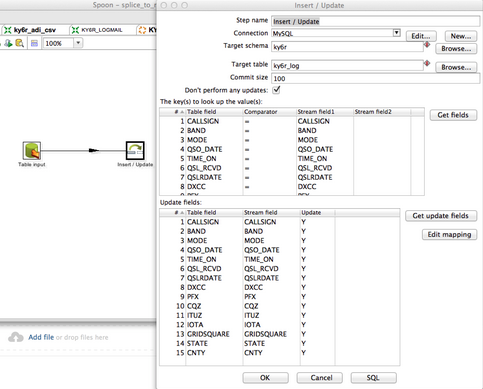
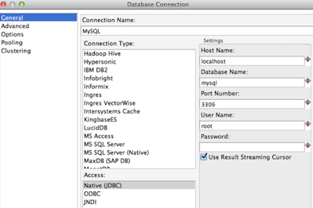

[Open topic with navigation](../../../index.html#Shared/Developers/Connecting/PentahoPDI.html)

Using Pentaho PDI with Splice Machine
=========================================

This topic describes using the Pentaho Data Integration ETL tool with Splice Machine. It is intended as an example of how Pentaho PDI can work with Splice Machine and data inputs and outputs in files and other databases.

About Pentaho PDI
-----------------

Pentaho Data Integration (PDI) is an ETL tool that is written in Java and is extensible and very powerful. It can be run as a standalone single instance ETL engine or run in a cluster. PDI uses the Kettle ETL engine.

NOTE:  ETL stands for Extraction, Transformation, and Loading of data.

Much of the power of PDI is due to the number and scope of built-in transformations that it includes, which you can drag, drop, and connect together using graphical tools. You can also define your own transformations in the language of your choice.

Pentaho PDI also supports Hadoop, HBase, MapReduce, and many other big data platforms, tools, and features, whihc means that you can use it to bridge the gap between SQL and NoSQL data stores. The Community edition of PDI is free and full featured; it is multi-threaded, distributed, and scales out, just like Splice Machine.

Downloading and Installing PDI
------------------------------

You can download and read the official documentation here for PDI in SourceForge or on the Pentaho community web site:

<http://community.pentaho.com/projects/data-integration/>

Example: Loading and Migrating Data into Splice Machine with Pentaho
--------------------------------------------------------------------

PDI features a graphical user interface tool named Spoon that offers a full development and test environment. You use Spoon to define job steps (or modules) known as Kettle routines.

The sample PDI job shown below shows how you can use PDI to load data from legacy databases such as Oracle and MySQL into Splice Machine and vice-versa. This job includes three Kettle routines:

-   ky6r\_adi\_csv loads an XML formatted file of data into Splice Machine
-   Splice to MySQL extracts data from Splice Machine and inserts into MySQL
-   MySQL to Splice extracts data from SQL and inserts back into Splice Machine
-   

### Details of the Example

This section describes the Kettle routines in the example.

1.  Configuring the Splice Machine database connection:

    For our example, we have configured the Splice Machine database connection using these values:

    | Field         | Values                                                                                                 |
    |---------------|--------------------------------------------------------------------------------------------------------|
    | Host Name     | If you are running Splice Machine on a cluster, use the IP address of an HBase Region Server node.     
                     Use localhost if you are using a standalone version of Splice Machine.  |
    | Database Name | splicedb                                                               |
    | Port Number   | 1527                                                                   |
    | User Name     | splice                                                                 |
    | Password      | admin                                                                  |

2.  Mapping the csv input:

    You map the fields in the csv file as input that is piped to the next step in a multi-threaded manner. Note that the csv input transformation is built into PDI; you simply specify the behavior of the data by setting parameters:

    

3.  Load CSV into Splice Machine:

    Loading the transformed data into Splice Machine requires another simple input step:

    

4.  Copy data from Splice Machine to MySQL:

    Copying the data from Splice Machine to MySQL is simply an insert with a nested select. You perform an extraction (SELECT \*) from Splice Machine and then an insertion into MySQL.

    

    Note that copied data is either inserted (if it doesn't exist already) or updated (it it already exists). Here is the configuration for the MySQL connection:

    

5.  Perform an extract from MySQL and copy it to Splice Machine:

    The final step is to perform an extraction from MySQL and copy (replace or insert) the extracted data into Splice Machine:

    

 

