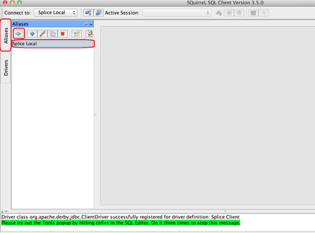
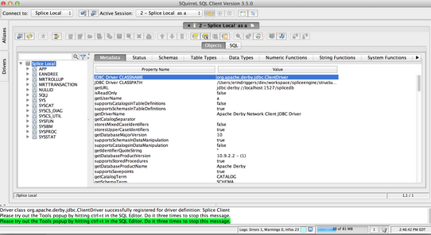

[Open topic with navigation](../../../index.html#Shared/Developers/Connecting/SquirrelClientSetup.html)

[]()Setting Up the SQuirreL Client for Splice Machine
=====================================================

This topic walks you through installing and configuring the SQuirreL SQL Client for use with your Splice Machine database, in the following sections:

-   [About the SQuirreL SQL Client](#AboutSquirrel)
-   [Installing the SQuirreL SQL Client](#InstallingSquirrel)
-   [Configuring SQuirreL for Splice Machine](#ConfiguringSquirrel)
-   [Using SQuirrel with Splice Machine](#UsingSquirrel)
-   [Configuring SQuirreL to Access a Splice Machine Database on AWS](#ConfigureAWS)

[]()About The SQuirreL SQL Client
---------------------------------

The <span class="ItalicFont">SQuirreL SQL Client</span> is an open source tool written in Java that provides a graphical interface that allows you to interact with your database in various ways, including:

-   viewing the structure of a JDBC compliant database
-   browsing the data in tables
-   issuing SQL commands

[]()Installing the SQuirreL SQL Client
--------------------------------------

This section presents installation instructions for the SQuirreL SQL Client for [MacOS](#MacOS) and [Windows](#PC) computers.

### []()Installing SQuirreL SQL on MacOS

Follow these steps to download and install SQuirreL on your MacOS computer:

1.  Download the installer:

    Download SQuirreL SQL for OSX from <http://squirrel-sql.sourceforge.net/>.

2.  Run the installer:

    Double-click the installer to run it, and accept default settings (click the <span class="AppCommand">Next</span> buttons) in the screens that are presented, until you see the Select Packs screen.

3.  Select packs:

    You only need to select the Derby Plugin, and we recommend also selecting the Oracle, SQL Server, and MySQL packs if you wish to perform any comparison tests,

    Once you've made your selections, click the <span class="AppCommand">Next</span> button to continue the installation.

4.  Complete the installation:

    Accept the defaults in the remaining screens to complete the installation.

### []()Installing SQuirreL SQL on Windows

Before installing SQuirreL on your Windows computer, make sure that you have version 1.7 or greater of the Java JRE installed. Then follow these steps to download and install SQuirreL on your Windows computer:

1.  Download the installer:

    Download SQuirreL SQL for Windows from <http://squirrel-sql.sourceforge.net/>.

2.  Run the installer:

    Open a Windows command prompt in the directory to which the installer was downloaded, and enter the following command. Substitute the exact name of the download file in the command:

    ``` ShellCommand
    java -jar squirrel-sql-<version>-standard.jar
    ```

    For example:

    ``` ShellCommand
    java-jar squirrel-sql-3.5.3-standard.jar
    ```

    Accept default settings (click the <span class="AppCommand">Next</span> buttons) in the screens that are presented, until you see the Select Packs screen.

3.  Select packs:

    You only need to select the Derby Plugin, and we recommend also selecting the Oracle, SQL Server, and MySQL packs if you wish to perform any comparison tests,

    Once you've made your selections, click the <span class="AppCommand">Next</span> button to continue the installation.

4.  Complete the installation:

    Accept the defaults in the remaining screens to complete the installation.

[]()Configuring SQuirreL SQL for Splice Machine
-----------------------------------------------

Before you can use SQuirreL with Splice Machine, you must create a new driver definition in SQuirreL for Splice Machine. Follow these steps:

1.  Create the Splice Machine driver definition:

    In the <span class="ItalicFont">Drivers</span> tab, click the blue + sign <span class="AppCommand">Create a New Driver</span> icon. The <span class="ItalicFont">Add Driver</span> window displays:

    

2.  Specify the driver name and example URL:

    In the <span class="ItalicFont">Add Driver</span> window, make these changes, which are shown in the image above:

    -   Enter <span class="CodeFont">SpliceMachine</span> in the <span class="AppCommand">Name</span> field.
    -   Enter <span class="CodeFont">jdbc:splice://localhost:1527/splicedb</span> in the <span class="AppCommand">Example URL</span> field.

    <span class="autonumber"><span class="noteAutoNum">IMPORTANT:  </span></span>You <span class="BoldFont">must</span> use the <span class="ItalicFont">Splice Machine</span> JDBC driver; other drivers will not work correctly.

3.  Add the driver path and class name:

    Still in the <span class="ItalicFont">Add Driver</span> window, also make these changes:

    -   Click the <span class="AppCommand">Extra Class Path</span> button to display the extra class tab. Click the <span class="AppCommand">Add</span> button and navigate to the Splice jar file. which you'll find it in the <span class="CodeFont">jdbc-driver</span> folder under the <span class="CodeFont">splicemachine</span> directory. Typical locations are:

        | OS      | Location                                                                                                   |
        |---------|------------------------------------------------------------------------------------------------------------|
        | MacOS   | \\splicemachine\\jdbc-driver\\<span class="PlatformVariablesJDBCDriverJar">db-client-2.0.1.18.jar</span>   |
        | Windows | C:\\splicemachine\\jdbc-driver\\<span class="PlatformVariablesJDBCDriverJar">db-client-2.0.1.18.jar</span> |

        <span class="autonumber"><span class="noteAutoNum">NOTE:  </span></span>Remember to substitute the actual Splice Machine version installed on your computer for <span class="HighlightedCode">&lt;version&gt;</span>.

    -   Click the <span class="AppCommand">List Drivers</span> button.
    -   At the bottom of the Add Driver window, select the Splice Machine driver from the ClassName drop-down:

        ``` PlainCell
        com.splicemachine.db.jdbc.ClientDriver
        ```

    -   Click the <span class="AppCommand">OK</span> button to add the driver.

4.  Create an instance of the Splice client:

    Click the <span class="ItalicFont">Aliases</span> tab in the SQuirreL window, and then click the <span class="AppCommand">Create new Alias</span> (blue + sign) button. Enter information into the <span class="ItalicFont">Add Alias</span> screen as shown, using these values:

    | Field     | Value to use                                                                                                    |
    |-----------|-----------------------------------------------------------------------------------------------------------------|
    | Name      | A name for your connection; for example, <span class="CodeFont">Test Database</span>.                           |
    | Driver    | Select the SpliceMachine driver in the drop-down list.                                                          |
    | URL       | If you're running the standalone version of Splice Machine, use:                                                
                                                                                                                                  
                 ``` PlainCell                                                                                                    
                 jdbc:splice://localhost:1527/splicedb                                                                            
                 ```                                                                                                              
                                                                                                                                  
                 If you're running on a cluster, specify your server name in place of <span class="AppCommand">localhost</span>.  |
    | User Name | <span class="AppCommand">splice</span>                                                                          |
    | Password  | <span class="AppCommand">admin</span>                                                                           |

5.  Test your settings:

    To test that your driver settings are correct, you need to make sure that Splice Machine is started on your local computer. Then click the <span class="AppCommand">Test</span> button in the <span class="ItalicFont">Add Alias</span> screen to verify that the driver is working properly.

    In the <span class="ItalicFont">Connect to:</span> screen that displays, enter <span class="AppCommand">splice</span> as the User ID and <span class="AppCommand">admin</span> as the password, and click the <span class="AppCommand">Connect</span> button.

    You should see the successful connection confirmation screen.

[]()Using SQuirreL with Splice Machine
--------------------------------------

When you're done configuring SQuirreL, you can connect to a Splice Machine database by following these steps:

1.  Start the SQuirreL client

2.  Select the Splice instance:

    In the SQuirreL screen, select the <span class="ItalicFont">Aliases</span> tab, double-click the Splice instance to which you want to connect. For example:

    

3.  Connect:

    The <span class="ItalicFont">Connect</span> pop-up window displays. Simply accept the default user and password values (these are currently ignored), and click the <span class="AppCommand">Connect</span> button. You'll see your schema and tables displayed:

    

4.  Enter queries:

    To enter SQL queries, select the <span class="AppCommand">SQL</span> tab (next to the <span class="AppCommand">Objects</span> tab button).

    

[]()Configure SQL to Access a Splice Machine Database on AWS
------------------------------------------------------------

You can leverage your existing Splice Local alias to connect to an instance of SpliceDb running on an AWS EC2 cluster.

To do so, you need to create an SSH tunnel that forwards the packets sent <span class="ItalicFont">on port 1527</span> to localhost port 1527 on your AWS instance. Use the following command line:

``` ShellCommand
ssh -i ~/.ssh/<aws-key-pair>.pem -v -N -p 22 -L1527:localhost:1527 ubuntu@<aws public hostname or public IP>
```

Then connect to your instance and enter queries as usual.

 


