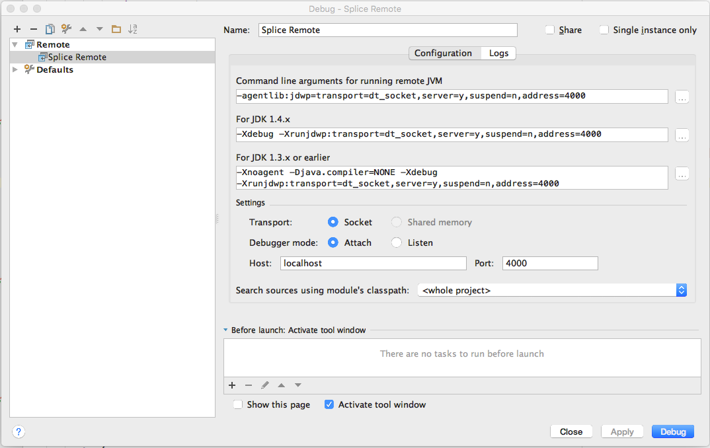

[Open topic with navigation](../../../index.html#Shared/Developers/TuningAndDebugging/Debugging.html)

Debugging Splice Machine
========================

This topic describes the parameter values you need to know for debugging Splice Machine with a software tool:

-   Create a configuration in your software to remotely attach to Splice Machine
-   Connect to port 4000.

    NOTE:  If you're debugging code that is to be run in a Spark worker, connect to port 4020 instead.

Example

Here's an example of an IntelliJ IDEA debugging configuration using port 4000:

For access to the full source code for Splice Machine, visit [our open source GitHub repository](https://github.com/splicemachine/spliceengine "Click to navigate to the Splice Machine Open Source GitHub repository (opens in new tab)"):  https://github.com/splicemachine/spliceengine

 

