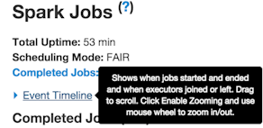
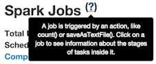

[Open topic with navigation](../../index.html#Shared/ManagementConsole/ConsoleFeatures.html)

Features of the Splice Machine Management Console
=====================================================

This section summarizes the use of major features of the management console interface, including:

-   [Drilling Down](#Drilling)
-   [Switching Views](#Switchin)
-   [Hovering](#Hovering)
-   [Refreshing the View](#Refreshi)
-   [Zooming the Timeline View](#Zooming)

Drilling Down
-----------------

In general, you can click anything that displays in blue (like this) to drill down into a more detailed view. For example, clicking Explain in the following description from the completed jobs table will drill down into the job details for Job 113:

You can continue to drill down from there to reveal increasing levels of detail.

Switching Views
-------------------

You can quickly switch to a different view by clicking a tab in the tab bar at the top of the console screen. The Jobs tab is selected in this screen shot:

### Hovering

You can hover the cursor over interface element links, like the Event Timeline drop-down in the following image, to display a screen tip for the item:

Similarly, you can hover over the ? to display the definition for a term, like the definition of a job:

And you can hover over an event in timeline display to see summary information; for example:

Refreshing the View
-----------------------

Currently, the console does not automatically or periodically refresh the view.

If you're monitoring an active job, you'll need to refresh your browser window to view the latest activity.

Zooming the Timeline View
-----------------------------

When you're viewing an event timeline, you can Enable zooming, which allows you to use mouse or touch gestures to zoom in on a portion or a timeline, zoom out, or scroll through the timeline.

See Also
--------

-   [About the Splice Machine In-Memory Engine](../../OnPremise/GettingStarted/InMemoryEngine.html)
-   [About the Splice Machine Management Console](Intro.ManagementConsole.html)
-   [Managing Queries with the Console](ManagingQueries.html)
-   [Using Spark Libraries with Splice Machine](../Developers/Fundamentals/SparkLibraries.html)

 

