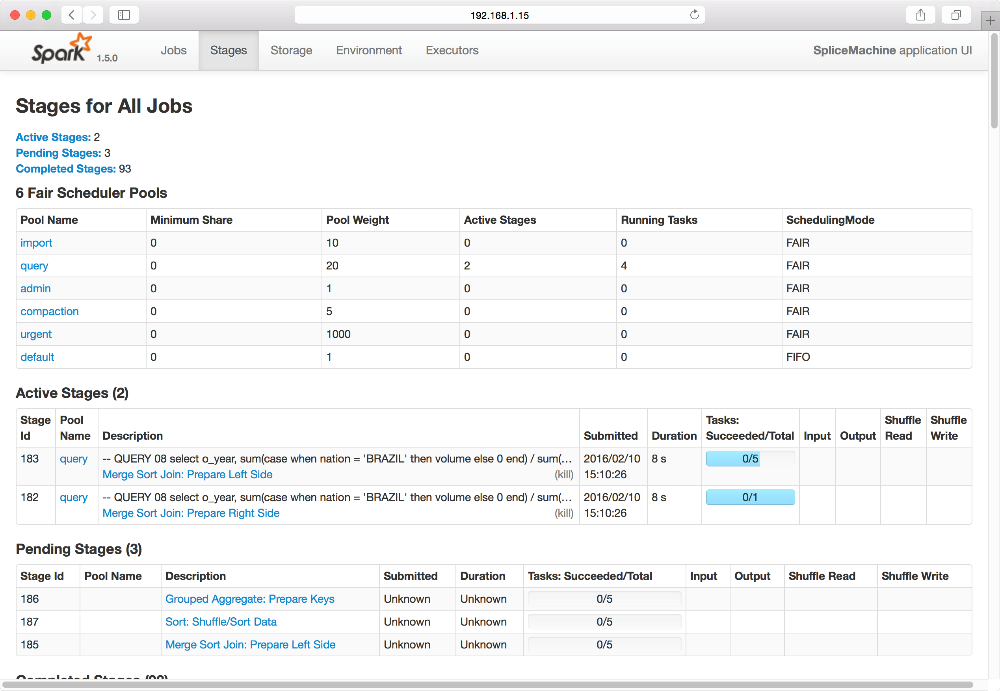
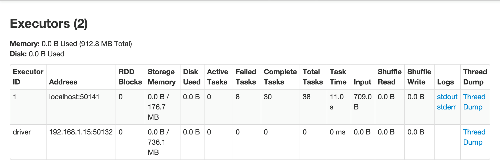
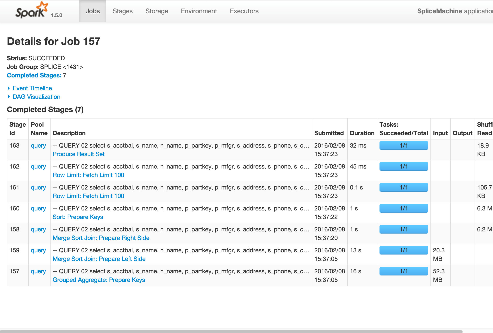
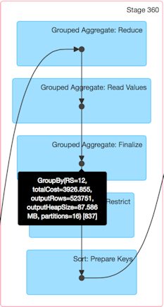
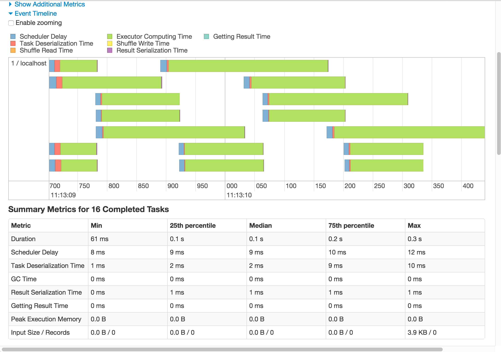
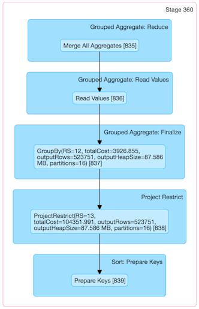
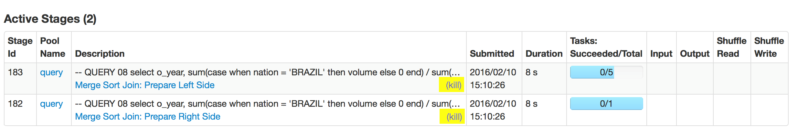
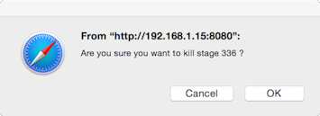

[Open topic with navigation](../../index.html#Shared/ManagementConsole/ManagingQueries.html)

Managing Queries with the Console
=====================================

The Splice Machine Management Console allows you to view queries that are currently running and have completed running in your database. You typically start at the top level, viewing jobs, and then drill down into individual job details, job stages, and task details, as described in these sections:

-   [Viewing Summary Pages](#Viewing4) describes the console's top-level summary pages.
-   [Viewing Job Details](#Viewing) describes the pages in which you can view details of active or completed jobs.
-   [Viewing Stage Details](#Viewing2) describes the pages in which you can view details of active and completed stages.
-   [Terminating a Stage](#Terminat) shows you how to terminate a job stage that is not performing as you think it should.

Viewing Summary Pages
-------------------------

The console includes five summary pages, each of which can be accessed from the tab bar at the top of the console window:

-   [The Jobs Summary page](#The2) shows information about all active and completed jobs.
-   [The Stages Summary Page](#The3) shows all stages for all jobs, both active and completed.
-   [The Storage Summary Page](#The4) shows any RDDs that you have persisted or cached to memory.
-   [The Environment Summary Page](#The5) shows information about the Spark run-time environment.
-   [The Executors Summary Page](#The6) shows the executors that are currently running.

### The Jobs Summary page

The Jobs Summary Page is the top-level view in the Splice Machine Management Console, It shows you a summary of any currently active and all completed jobs.

You land on this page when you first view the Management Console in your browser, and you can view it at any time by clicking the Jobs tab in the tab bar at the top of the page.

NOTE:  A stage is shown as skipped when the data has been fetched from a cache and there was no need to reexecute the stage; this happens when shuffling data because the Spark engine automatically caches generated data.

You can click the a job description name (in blue) to view job details of any job in the Active Jobs or Completed Jobs sections.

### The Stages Summary Page

The StagesSummary Page shows you the available scheduling pools, and a summary of the stages for all active and completed jobs. You can access this page by clicking the Stages tab in the tab bar at the top of the window.

You can click the descriptive name of a stage (in blue) to view the stage details.

The Fair Scheduler Pools section at the top of the page shows the name and weighting value for each of the scheduler pools that have been defined for your database jobs.

### The Storage Summary Page

The Storage Summary Page displays information about any RDDs that are currently persisted or cached. You can access this page by clicking the Storage tab in the tab bar at the top of the window:

### The Environment Summary Page

The Environment Summary Page displays information about which software versions you're using, and shows the values of the Spark-related environment variables. You can access this page by clicking the Environment tab in the tab bar at the top of the window:

### The Executors Summary Page

The Executors Summary Page shows you the Spark executors that are currently running. You can access this page by clicking the Executors tab in the tab bar at the top of the window:

You can click Thread Dump to display a thread dump for an executor, or you can click a log name to see the contents of the log.

Viewing Job Details
-----------------------

If you click a job to see its details, you'll see a screen like the following displayed, which shows the stages of the job:

You can expand the job detail display by selecting the Event Timeline and/or DAG Visualization buttons.

### Job Details Event Time Line View

The job details time-line view looks like the following screen shot:

 

### Job Details Graphical Visualization View

The DAG Visualization view for a job looks like this:

Some key things to know about the DAG view are:

-   You can click in the box representing a stage to view the detailed tasks within that stage. For an example, see [Graphical View of the Tasks in a Stage](#Graphica), in the next section.

-   You can hover over any of the black dots inside a task box to display information about the task. For example:

    

Viewing Stage Details
-------------------------

Viewing stage details is very much the same as viewing job details. If you click the name of a stage in another page, the detailed view of that stage displays:

### The Event Time Line View of a Stage

The Event Timeline view of a stage looks like this:

### Graphical View of the Tasks in a Stage

The DAG Visualization view of a stage looks like this:

Terminating a Stage
-----------------------

If you conclude that an active job stage is not performing the way you think it should, you can terminate a stage by clicking the Kill button shown in the description of every active stage. The following image highlights the kill buttons that you'll find in the console display:

You'll be prompted to verify that you want the stage terminated:

You can access the Kill button by drilling down into a job's stages, or by selecting the Stages tab in the tab bar, which displays all stages for all jobs.

See Also
--------

-   [The Splice Machine In-Memory Engine](../../OnPremise/GettingStarted/InMemoryEngine.html)
-   [About the Splice Machine Management Console](Intro.ManagementConsole.html)
-   [User Interface Features of the Splice Machine Management Console](ConsoleFeatures.html)
-   [Using Spark Libraries with Splice Machine](../Developers/Fundamentals/SparkLibraries.html)

 

